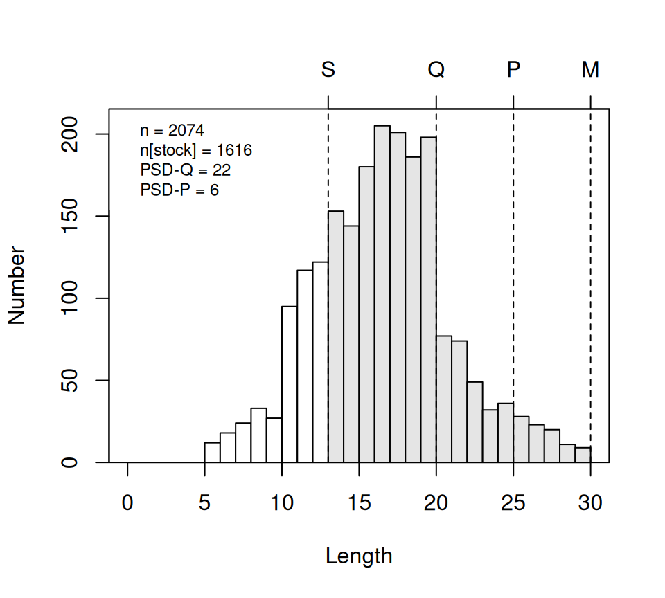
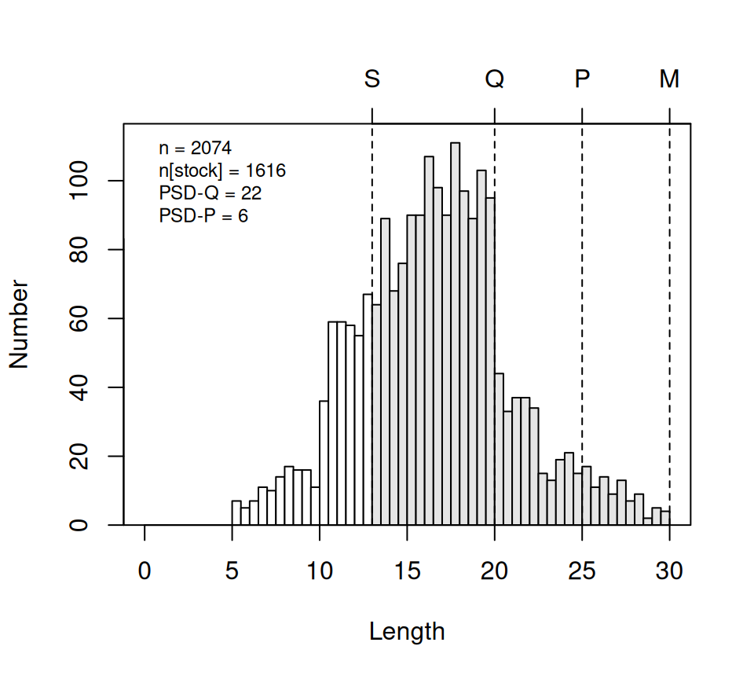

# Computing Proportional Size Distribution Metrics in FSA

## Introduction

Summarizing the size structure of fish populations is a common practice
for informing fisheries management decisions. One common method for
summarizing size structures in North America is to compute the
percentage of fish that have reached some minimum size that have also
reached a more advanced size. These sizes have been standardized for a
number of common North American game fishes and are generally called
Gabelhouse lengths, after the author that first described them. The
specific percentages are called *proportional size distribution* (PSD)
metrics, and are described in detail in various resources, including
[Ogle (2016)](https://derekogle.com/IFAR/). This article assumes you
understand the basics of PSD calculations and will show how to make
those calculations using functions in the `FSA` package.

The following packages are used herein. Note that the `FSA` functions
described here were modified after version 0.9.6 and are thus **specific
to FSA \>v0.9.6**.

``` r
library(FSA)
library(dplyr)  # mutate, select, filter, case_when
```

## Looking-Up PSD-Related Lengths

### Gabelhouse Length Categories

Five-cell Gabelhouse (GH) length categories have been deveoped for a
number of freshwater game fish in the United States, as well as several
non-game fish in the United States and some other fish from outside of
the United States. These values have been collated into the `PSDlit`
data.frame[¹](#fn1) distributed with `FSA` and are most easily accessed
with
[`psdVal()`](https://fishr-core-team.github.io/FSA/reference/psdVal.md).
For example, the GH length categories for Bluegill are retrieved below.

``` r
psdVal("Bluegill")
#>  substock     stock   quality preferred memorable    trophy 
#>         0        80       150       200       250       300
```

The default is to return lengths in millimeters; however, they can be
returned in centimeters or inches with `units=`.[²](#fn2)

``` r
psdVal("Bluegill",units="cm")
#>  substock     stock   quality preferred memorable    trophy 
#>         0         8        15        20        25        30
psdVal("Bluegill",units="in")
#>  substock     stock   quality preferred memorable    trophy 
#>         0         3         6         8        10        12
```

By default, a sixth cell is included that is labeled as “substock” and
will always have the value of 0. This can be useful for some analyses
with data that includes individuals shorter than the stock length. Use
`incl.zero=FALSE` to exclude this category.

``` r
psdVal("Bluegill",incl.zero=FALSE)
#>     stock   quality preferred memorable    trophy 
#>        80       150       200       250       300
```

Use of
[`psdVal()`](https://fishr-core-team.github.io/FSA/reference/psdVal.md)
requires spelling (and capitalizing) the species name as it appears in
`PSDlit`. One can see all species names available in `PSDlit` with
[`psdVal()`](https://fishr-core-team.github.io/FSA/reference/psdVal.md)
without any arguments.

``` r
psdVal()
#> 
#> Species name must be one of following. Be careful of spelling and capitalization.
#>  [1] "Alabama Bass"                "Arctic Grayling"            
#>  [3] "Bighead Carp"                "Bigmouth Buffalo"           
#>  [5] "Black Bullhead"              "Black Carp"                 
#>  [7] "Black Crappie"               "Blue Catfish"               
#>  [9] "Bluegill"                    "Brook Trout"                
#> [11] "Brook Trout (lentic)"        "Brook Trout (lotic)"        
#> [13] "Brook Trout (overall)"       "Brown Bullhead"             
#> [15] "Brown Trout"                 "Brown Trout (lentic)"       
#> [17] "Brown Trout (lotic)"         "Bull Trout"                 
#> [19] "Burbot"                      "Chain Pickerel"             
#> [21] "Channel Catfish"             "Chinook Salmon"             
#> [23] "Chinook Salmon (landlocked)" "Common Carp"                
#> [25] "Cutthroat Trout"             "Cutthroat Trout (lentic)"   
#> [27] "Cutthroat Trout (lotic)"     "Flathead Catfish"           
#> [29] "Flier"                       "Freshwater Drum"            
#> [31] "Gizzard Shad"                "Golden Trout"               
#> [33] "Goldeye"                     "Grass Carp"                 
#> [35] "Green Sunfish"               "Kokanee"                    
#> [37] "Lake Chubsucker"             "Lake Trout"                 
#> [39] "Largemouth Bass"             "Longear Sunfish"            
#> [41] "Longnose Gar"                "Muskellunge"                
#> [43] "Muskellunge (female)"        "Muskellunge (male)"         
#> [45] "Muskellunge (overall)"       "Northern Pike"              
#> [47] "Northern Pikeminnow"         "Northern Snakehead"         
#> [49] "Paddlefish"                  "Paddlefish (female)"        
#> [51] "Paddlefish (male)"           "Paddlefish (overall)"       
#> [53] "Pallid Sturgeon"             "Palmetto Bass"              
#> [55] "Palmetto Bass (original)"    "Pumpkinseed"                
#> [57] "Rainbow Trout"               "Rainbow Trout (lentic)"     
#> [59] "Rainbow Trout (lotic)"       "Redbreast Sunfish"          
#> [61] "Redear Sunfish"              "River Carpsucker"           
#> [63] "Rock Bass"                   "Ruffe"                      
#> [65] "Sauger"                      "Saugeye"                    
#> [67] "Shoal Bass"                  "Shorthead Redhorse"         
#> [69] "Silver Carp"                 "Smallmouth Bass"            
#> [71] "Smallmouth Buffalo "         "Splake"                     
#> [73] "Spotted Bass"                "Spotted Bass (original)"    
#> [75] "Spotted Gar"                 "Spotted Sunfish"            
#> [77] "Striped Bass"                "Striped Bass (landlocked)"  
#> [79] "Striped Bass X White Bass"   "Suwannee Bass"              
#> [81] "Utah Chub"                   "Walleye"                    
#> [83] "Walleye (30-149 mm)"         "Walleye (overall)"          
#> [85] "Warmouth"                    "White Bass"                 
#> [87] "White Catfish"               "White Crappie"              
#> [89] "White Perch"                 "White Sucker"               
#> [91] "Yellow Bass"                 "Yellow Bullhead"            
#> [93] "Yellow Perch"
```

All parts of the species names in `PSDlit` are capitalized (e.g., “Brown
Trout” and not “brown trout” or “Brown trout”).
[`psdVal()`](https://fishr-core-team.github.io/FSA/reference/psdVal.md)
will return an informative error message if your capitalization is not
correct but the message will be less informative if your spelling is
off.

``` r
psdVal("Brown trout")
#> Error:
#> ! There are no Gablehouse lengths in 'PSDlit' for "Brown trout". However,
#>   there is an entry for "Brown Trout" (note spelling, including
#>   capitalization).
psdVal("Brwn Trout")
#> Error:
#> ! There are no Gablehouse lengths in 'PSDlit' for "Brwn Trout". Type
#>   'psdVal()' to see a list of available species.
```

A small number of species have separate length designations for
sub-groups of the species. One way to determine this is to simply try a
species in
[`psdVal()`](https://fishr-core-team.github.io/FSA/reference/psdVal.md)
to see if you receive an informative error about the sub-groups.

``` r
psdVal("Brown Trout")
#> Error:
#> ! "Brown Trout" has Gabelhouse categories for these sub-groups: "lentic"
#>   and "lotic". Please use 'group=' to select one of these groups.
```

Then try again with `group=` to select a specific group as suggested.

``` r
psdVal("Brown Trout",group="lotic")
#>  substock     stock   quality preferred memorable    trophy 
#>         0       150       230       300       380       460
```

These same species and sub-group combinations can also be accessed by
combining the species name and lower-case sub-group name (in
parenthesis) into the first argument (and then not using `group=`).

``` r
psdVal("Brown Trout (lotic)")
#>  substock     stock   quality preferred memorable    trophy 
#>         0       150       230       300       380       460
```

Thus, species with sub-group designations can be identified by scanning
the list of names returned by
[`psdVal()`](https://fishr-core-team.github.io/FSA/reference/psdVal.md)
for parentheses. This has some limitations as there are a few species
that appear to have a sub-group but the name with parentheses is only
used here (in `PSDlit`) to facilitate use when calculating PSD and
relative weight metrics[³](#fn3) with the same data.frame. Muskellunge
is an example of this where there is only one set of GH length
categories but they are repeated for separate sub-groups because
separate standard weight equations exist for these sub-groups.

``` r
psdVal("Muskellunge")
#>  substock     stock   quality preferred memorable    trophy 
#>         0       510       760       970      1070      1270
psdVal("Muskellunge (overall)")
#>  substock     stock   quality preferred memorable    trophy 
#>         0       510       760       970      1070      1270
psdVal("Muskellunge (female)")
#>  substock     stock   quality preferred memorable    trophy 
#>         0       510       760       970      1070      1270
psdVal("Muskellunge (male)")
#>  substock     stock   quality preferred memorable    trophy 
#>         0       510       760       970      1070      1270
```

There are also a few species where an original definition of GH length
categories has been revised in the literature. The original and revised
definitions are available in `PSDlit` with the revised definitions
accessed by using just the species name and the original definitions
accessed by appending “(original)” to the species name.

``` r
psdVal("Spotted Bass")             # revised definitions
#>  substock     stock   quality preferred memorable    trophy 
#>         0       150       230       300       350       440
psdVal("Spotted Bass (original)")
#>  substock     stock   quality preferred memorable    trophy 
#>         0       180       280       350       430       510
```

We strongly urge you to have a good understanding of the GH length
categories for your species’ of interest and make sure that
[`psdVal()`](https://fishr-core-team.github.io/FSA/reference/psdVal.md)
is returning the values that you expect (i.e., correct species,
sub-group (if appropriate), units, etc.).

### Additional Length Categories

There may be times when you desire length categories in addition to the
GH lengths. For example, suppose that the minimum length limit for
Largemouth Bass is 254 mm. This length can be included as one of the
categories by including a vector with the length (or lengths) to
`addLens=`. If the item in the vector is named (second example below)
then the value will also be named in the returned result.

``` r
psdVal("Largemouth Bass",addLens=254)
#>  substock     stock       254   quality preferred memorable    trophy 
#>         0       200       254       300       380       510       630
psdVal("Largemouth Bass",addLens=c("minLen"=254))
#>  substock     stock    minLen   quality preferred memorable    trophy 
#>         0       200       254       300       380       510       630
```

Multiple additional lengths can be included.

``` r
psdVal("Largemouth Bass",addLens=c("minSlot"=254,"maxSlot"=356))
#>  substock     stock   minSlot   quality   maxSlot preferred memorable    trophy 
#>         0       200       254       300       356       380       510       630
```

## Add Length Categories for One Species

### “Manual” Additions

Suppose that we want to add a variable with the GH length categories to
the data.frame of lengths (along with capture location) for Yellow Perch
from Saginaw Bay, MI in `YPerchSB1` (distributed with the `FSAdata`
package). Note here that lengths are in **centimeters**.

``` r
data(YPerchSB1,package="FSAdata")  # retrieve the data.frame
peek(YPerchSB1,n=10)
#>        tl   loc
#> 1     7.4 inner
#> 230  10.8 inner
#> 461  13.9 inner
#> 691  15.4 inner
#> 922  18.1 inner
#> 1152 21.1 inner
#> 1383 14.6 outer
#> 1613 18.0 outer
#> 1844 21.8 outer
#> 2074 29.9 outer
```

First, save the GH length categories returned from
[`psdVal()`](https://fishr-core-team.github.io/FSA/reference/psdVal.md)
to an object (here called `ghYP`).

``` r
( ghYP <- psdVal("Yellow Perch",units="cm") )
#>  substock     stock   quality preferred memorable    trophy 
#>         0        13        20        25        30        38
```

Then use
[`lencat()`](https://fishr-core-team.github.io/FSA/reference/lencat.md)
with the length variable as the first argument and the GH length
categories object in `breaks=`.[⁴](#fn4)

``` r
YPerchSB1 <- YPerchSB1 |>
  mutate(ghcats1=lencat(tl,breaks=ghYP))
peek(YPerchSB1,n=10)
#>        tl   loc ghcats1
#> 1     7.4 inner       0
#> 230  10.8 inner       0
#> 461  13.9 inner      13
#> 691  15.4 inner      13
#> 922  18.1 inner      13
#> 1152 21.1 inner      20
#> 1383 14.6 outer      13
#> 1613 18.0 outer      13
#> 1844 21.8 outer      20
#> 2074 29.9 outer      25
```

By default,
[`lencat()`](https://fishr-core-team.github.io/FSA/reference/lencat.md)
creates a variable with the length values rather than the category
names. Use `use.names=TRUE` to use category names instead.[⁵](#fn5)

``` r
YPerchSB1 <- YPerchSB1 |>
  mutate(ghcats2=lencat(tl,breaks=ghYP,use.names=TRUE))
peek(YPerchSB1,n=10)
#>        tl   loc ghcats1   ghcats2
#> 1     7.4 inner       0  substock
#> 230  10.8 inner       0  substock
#> 461  13.9 inner      13     stock
#> 691  15.4 inner      13     stock
#> 922  18.1 inner      13     stock
#> 1152 21.1 inner      20   quality
#> 1383 14.6 outer      13     stock
#> 1613 18.0 outer      13     stock
#> 1844 21.8 outer      20   quality
#> 2074 29.9 outer      25 preferred
```

### Use the `psdAdd()` Convenience Function

[`psdAdd()`](https://fishr-core-team.github.io/FSA/reference/psdAdd.md)
can be used to add a length categorization variable to a data.frame for
**all** species in the data.frame for which the GH length categories
exists.[⁶](#fn6) The main argument to
[`psdAdd()`](https://fishr-core-team.github.io/FSA/reference/psdAdd.md)
is a formula of the form `length~species`, where `length` is the name of
the observed length variable and `species` is the name of the species
variable. In these data there is no variable that identified the
species, likely because the data contains only one species. Thus, before
[`psdAdd()`](https://fishr-core-team.github.io/FSA/reference/psdAdd.md)
can be used in this example, a new variable with the species name was
added.[⁷](#fn7)

``` r
data(YPerchSB1,package="FSAdata")
YPerchSB1 <- YPerchSB1 |>
  mutate(spec="Yellow Perch",
         ghcats1=psdAdd(tl~spec,units="cm"))
peek(YPerchSB1,n=10)
#>        tl   loc         spec   ghcats1
#> 1     7.4 inner Yellow Perch  substock
#> 230  10.8 inner Yellow Perch  substock
#> 461  13.9 inner Yellow Perch     stock
#> 691  15.4 inner Yellow Perch     stock
#> 922  18.1 inner Yellow Perch     stock
#> 1152 21.1 inner Yellow Perch   quality
#> 1383 14.6 outer Yellow Perch     stock
#> 1613 18.0 outer Yellow Perch     stock
#> 1844 21.8 outer Yellow Perch   quality
#> 2074 29.9 outer Yellow Perch preferred
```

[`psdAdd()`](https://fishr-core-team.github.io/FSA/reference/psdAdd.md)
requires that the species variable have the species names in the
spelling and capitalization used by `PSDlit`. So, for example, suppose
that the `YPerchSB1` species names used the abbreviation `yep` rather
than `Yellow Perch`.[⁸](#fn8) A named list or vector can be given to
`thesaurus=` that defines how the original species names (i.e., the
items to the right of the `=` in the vector) relate to the species names
required by `PSDlit` (i.e., the names to the left of the `=` in the
vector).
[`psdAdd()`](https://fishr-core-team.github.io/FSA/reference/psdAdd.md)
will match the two names appropriately while creating the GH length
categories.

``` r
data(YPerchSB1,package="FSAdata")
YPerchSB1 <- YPerchSB1 |>
  mutate(spec="yep",
         ghcats1=psdAdd(tl~spec,units="cm",thesaurus=c("Yellow Perch"="yep")))
peek(YPerchSB1,n=10)
#>        tl   loc spec   ghcats1
#> 1     7.4 inner  yep  substock
#> 230  10.8 inner  yep  substock
#> 461  13.9 inner  yep     stock
#> 691  15.4 inner  yep     stock
#> 922  18.1 inner  yep     stock
#> 1152 21.1 inner  yep   quality
#> 1383 14.6 outer  yep     stock
#> 1613 18.0 outer  yep     stock
#> 1844 21.8 outer  yep   quality
#> 2074 29.9 outer  yep preferred
```

## Add Length Categories for Multiple Species

The real value of
[`psdAdd()`](https://fishr-core-team.github.io/FSA/reference/psdAdd.md)
is that it can be used to efficiently add length categories for multiple
species in a single data.frame. This is illustrated below for a variety
of scenarios.

### “Good” Names and No Groups

`InchLake2` distributed with `FSAdata` contains lengths for several
species captured from Inch Lake. These data provide a simple example for
using
[`psdAdd()`](https://fishr-core-team.github.io/FSA/reference/psdAdd.md)
because all species names are spelled and capitalized as required (i.e.,
same as in \`PSDlit1) and none of the species have sub-groups.[⁹](#fn9)
Note that lengths are in **inches** here.

``` r
data("InchLake2",package="FSAdata")  # retrieve the data.frame
peek(InchLake2,n=10)
#>     netID fishID          species length weight year
#> 1     206    501         Bluegill    1.5    0.7 2008
#> 57     16    208    Black Crappie   11.6  380.0 2007
#> 115   101    583         Bluegill    5.5   48.0 2008
#> 172   102    642 Bluntnose Minnow    2.1    1.3 2008
#> 229   116    760  Largemouth Bass    2.8    2.0 2008
#> 287   109    843  Largemouth Bass   13.1  460.0 2008
#> 344   130    902  Largemouth Bass   10.1  173.0 2008
#> 401     6    178         Bluegill    6.2   62.0 2007
#> 459    12     45 Bluntnose Minnow    2.7    6.0 2007
#> 516     4    127         Bluegill    6.6   90.0 2007
```

[`psdAdd()`](https://fishr-core-team.github.io/FSA/reference/psdAdd.md)
can be used as described previously (i.e., with a formula of the form
`length~species` and `units=`) to add GH length categories for all
species in the data.frame for which GH length categories exist in
`PSDlit`. A message will be issued identifying the species in the
data.frame for which GH length categories do not exist. The new variable
will show `<NA>` for those species.

``` r
InchLake2 <- InchLake2 |>
  mutate(ghcats1=psdAdd(length~species,units="in"))
#> Species in the data with no Gabelhouse (PSD) lengths in `PSDlit`: "Iowa
#>   Darter", "Bluntnose Minnow", "Tadpole Madtom", and "Fathead Minnow".
peek(InchLake2,n=10)
#>     netID fishID          species length weight year   ghcats1
#> 1     206    501         Bluegill    1.5    0.7 2008  substock
#> 57     16    208    Black Crappie   11.6  380.0 2007 preferred
#> 115   101    583         Bluegill    5.5   48.0 2008     stock
#> 172   102    642 Bluntnose Minnow    2.1    1.3 2008      <NA>
#> 229   116    760  Largemouth Bass    2.8    2.0 2008  substock
#> 287   109    843  Largemouth Bass   13.1  460.0 2008   quality
#> 344   130    902  Largemouth Bass   10.1  173.0 2008     stock
#> 401     6    178         Bluegill    6.2   62.0 2007   quality
#> 459    12     45 Bluntnose Minnow    2.7    6.0 2007      <NA>
#> 516     4    127         Bluegill    6.6   90.0 2007   quality
```

Additional non-GH length categories can be used with
[`psdAdd()`](https://fishr-core-team.github.io/FSA/reference/psdAdd.md)
through `addLens()` similar to what was described for
[`psdVal()`](https://fishr-core-team.github.io/FSA/reference/psdVal.md).
However, a named list must be given to `addLens()` that has named
vectors for each species for the additional lengths to be added. An
example for this is given in [the
documentation](https://fishr-core-team.github.io/FSA/reference/psdAdd.html)
for
[`psdAdd()`](https://fishr-core-team.github.io/FSA/reference/psdAdd.md).

### “Bad” Names and No Groups

Now consider the `Herman` data.frame (distributed with the `FSAdata`
package) that has the lengths (cm) of four species – Walleye, Yellow
Perch, Black Crappie, and Black Bullhead – from Lake Herman, SD. These
four species do not have sub-groups defined in `PSDlit`. However,
observing the data below[¹⁰](#fn10) shows that the species variable
(`spec`) contains codes for the species names rather than the names
required by `PSDlit`.

``` r
data(Herman,package="FSAdata")  # retrieve the data.frame
peek(Herman,n=10)
#>        tl spec   yr
#> 1    16.6  wae 1999
#> 659  23.0  bkc 2003
#> 1318 22.7  bbh 2003
#> 1977 23.1  bbh 2003
#> 2636 24.6  bbh 2003
#> 3295 24.5  bbh 2003
#> 3954 25.6  bbh 2003
#> 4613 25.2  bbh 2003
#> 5272 26.1  bbh 2003
#> 5931 34.8  bbh 2005
```

One way to deal with the issue of “bad” species names is to use a named
list or vector that defines how the names from `PSDlit` should be
matched to the names in the data.frame. As before, the species names in
`PSDlit` are the names in the vector (i.e., before the `=`) and the
species names in the data.frame are the items in the vector (i.e., after
the `=`).

``` r
thes <- c("Walleye"="wae","Yellow Perch"="yep",
          "Black Crappie"="bkc","Black Bullhead"="bbh")
```

This list/vector is then given to `thesaurus=` in
[`psdAdd()`](https://fishr-core-team.github.io/FSA/reference/psdAdd.md)
which will perform the name matching while creating the GH length
categories.

``` r
Herman <- Herman |>
  mutate(ghcats1=psdAdd(tl~spec,units="cm",thesaurus=thes))
peek(Herman,n=10)
#>        tl spec   yr   ghcats1
#> 1    16.6  wae 1999  substock
#> 659  23.0  bkc 2003   quality
#> 1318 22.7  bbh 2003     stock
#> 1977 23.1  bbh 2003   quality
#> 2636 24.6  bbh 2003   quality
#> 3295 24.5  bbh 2003   quality
#> 3954 25.6  bbh 2003   quality
#> 4613 25.2  bbh 2003   quality
#> 5272 26.1  bbh 2003   quality
#> 5931 34.8  bbh 2005 preferred
```

`thesaurus=` can be used even if only some of the species names are
non-“standard.” Additionally, the named list/vector in `thesaurus=` can
contain names that don’t exist in the original data.frame. Thus, a
global thesaurus containing all species that *could* be encountered
could be created, for example as an agency-wide definition, and used
with a variety of specific data.frames.

### “Bad” Names and Groups

The use of
[`psdAdd()`](https://fishr-core-team.github.io/FSA/reference/psdAdd.md)
can become complicated for data.frames with species names other than
what `PSDlit` expects and species for which GH lengths exist for
sub-groups, especially if more than one sub-group is in the data. The
hypothetical data set `PSDWRtest` distributed with `FSA` can be used to
illustrate how to handle these “issues”.

``` r
peek(PSDWRtest,n=20)
#>               species     location  len      wt  sex
#> 1    Bluegill Sunfish    Bass Lake  107    25.8 <NA>
#> 53   Bluegill Sunfish    Bass Lake  116    34.8 <NA>
#> 107  Bluegill Sunfish    Bass Lake  191   138.3 <NA>
#> 160       Brook Trout   Trout Lake  291      NA <NA>
#> 214       Brown Trout   Trout Lake  151    45.4 <NA>
#> 267       Brown Trout   Trout Lake  190    86.3 <NA>
#> 321       Brown Trout Brushy Creek  318   198.4    M
#> 374       Brown Trout Brushy Creek  446   533.4    F
#> 428   Largemouth Bass    Bass Lake  199    70.1 <NA>
#> 481   Largemouth Bass    Bass Lake  306   311.9 <NA>
#> 535   Lean Lake Trout   Trout Lake  529  1480.0    F
#> 588   Lean Lake Trout   Trout Lake  809  5448.1    F
#> 642       Muskellunge    Long Lake 1097 11376.4    U
#> 695           Walleye    Bass Lake   72     3.5 <NA>
#> 749           Walleye    Bass Lake  307   273.6    M
#> 802           Walleye    Bass Lake  345   429.8    F
#> 856      Yellow Perch    Bass Lake  165    59.4    F
#> 909      Yellow Perch    Bass Lake  150    40.2    F
#> 963      Yellow Perch    Bass Lake  241   187.9    F
#> 1016     Yellow Perch    Bass Lake  322   520.0    F
```

[`psdAdd()`](https://fishr-core-team.github.io/FSA/reference/psdAdd.md)
will produce some informative error messages, but it is best that you
have a full understanding of the issues that may arise with your data by
carefully examining your data and understanding the GH length categories
for the species in your data. The “issues” that need to be addressed
with the `PSDWRtest` data are as follows:

- “Bluegill Sunfish” was used rather than “Bluegill”.
- “Lean Lake Trout” was used rather than “Lake Trout”.
- Brook Trout were sampled from a lotic (“Trout Lake”) system, for which
  there are sub-groups for GH length categories.
- Brown Trout were sampled from a lotic (“Trout Lake”) and lentic
  (“Brush Creek”) system, for which there are sub-groups for GH length
  categories.

The easiest way to deal with all of these “issues” is to create a new
“species” variable (i.e., `species2` below) that appends the specific
groups in parentheses to the species name. There are a variety of ways
to do this and which way (is best or works) may depend on the specifics
of the situation. Here,
[`case_when()`](https://dplyr.tidyverse.org/reference/case_when.html)
from `dplyr` is used with a series of statements that begin with a
“condition” to the left of the `~` and a new species “name” for that
condition to the right of the `~`. The `.default=species` at the end
will put the name from `species` into `species2` for all situations
where none of the conditions above it are met (e.g., if `species` is
“Yellow Perch” then `species2` will be “Yellow Perch”).

``` r
PSDWRtest <- PSDWRtest |>
  mutate(species2=case_when(
           species=="Bluegill Sunfish" ~ "Bluegill",
           species=="Lean Lake Trout" ~ "Lake Trout",
           species=="Brown Trout" & location=="Trout Lake" ~  "Brown Trout (lotic)",
           species=="Brown Trout" & location=="Brushy Creek" ~  "Brown Trout (lentic)",
           species=="Brook Trout" & location=="Trout Lake" ~  "Brook Trout (lotic)",
           .default=species
         ))
peek(PSDWRtest,n=20)
#>               species     location  len      wt  sex             species2
#> 1    Bluegill Sunfish    Bass Lake  107    25.8 <NA>             Bluegill
#> 53   Bluegill Sunfish    Bass Lake  116    34.8 <NA>             Bluegill
#> 107  Bluegill Sunfish    Bass Lake  191   138.3 <NA>             Bluegill
#> 160       Brook Trout   Trout Lake  291      NA <NA>  Brook Trout (lotic)
#> 214       Brown Trout   Trout Lake  151    45.4 <NA>  Brown Trout (lotic)
#> 267       Brown Trout   Trout Lake  190    86.3 <NA>  Brown Trout (lotic)
#> 321       Brown Trout Brushy Creek  318   198.4    M Brown Trout (lentic)
#> 374       Brown Trout Brushy Creek  446   533.4    F Brown Trout (lentic)
#> 428   Largemouth Bass    Bass Lake  199    70.1 <NA>      Largemouth Bass
#> 481   Largemouth Bass    Bass Lake  306   311.9 <NA>      Largemouth Bass
#> 535   Lean Lake Trout   Trout Lake  529  1480.0    F           Lake Trout
#> 588   Lean Lake Trout   Trout Lake  809  5448.1    F           Lake Trout
#> 642       Muskellunge    Long Lake 1097 11376.4    U          Muskellunge
#> 695           Walleye    Bass Lake   72     3.5 <NA>              Walleye
#> 749           Walleye    Bass Lake  307   273.6    M              Walleye
#> 802           Walleye    Bass Lake  345   429.8    F              Walleye
#> 856      Yellow Perch    Bass Lake  165    59.4    F         Yellow Perch
#> 909      Yellow Perch    Bass Lake  150    40.2    F         Yellow Perch
#> 963      Yellow Perch    Bass Lake  241   187.9    F         Yellow Perch
#> 1016     Yellow Perch    Bass Lake  322   520.0    F         Yellow Perch
```

The GH length categories are added to this data.frame with
[`psdAdd()`](https://fishr-core-team.github.io/FSA/reference/psdAdd.md),
specifically noting the use of the new `species2` variable.

``` r
PSDWRtest$psd <- psdAdd(len~species2,data=PSDWRtest)
#> Species in the data with no Gabelhouse (PSD) lengths in `PSDlit`: "Iowa
#>   Darter".
peek(PSDWRtest,n=20)
#>               species     location  len      wt  sex             species2
#> 1    Bluegill Sunfish    Bass Lake  107    25.8 <NA>             Bluegill
#> 53   Bluegill Sunfish    Bass Lake  116    34.8 <NA>             Bluegill
#> 107  Bluegill Sunfish    Bass Lake  191   138.3 <NA>             Bluegill
#> 160       Brook Trout   Trout Lake  291      NA <NA>  Brook Trout (lotic)
#> 214       Brown Trout   Trout Lake  151    45.4 <NA>  Brown Trout (lotic)
#> 267       Brown Trout   Trout Lake  190    86.3 <NA>  Brown Trout (lotic)
#> 321       Brown Trout Brushy Creek  318   198.4    M Brown Trout (lentic)
#> 374       Brown Trout Brushy Creek  446   533.4    F Brown Trout (lentic)
#> 428   Largemouth Bass    Bass Lake  199    70.1 <NA>      Largemouth Bass
#> 481   Largemouth Bass    Bass Lake  306   311.9 <NA>      Largemouth Bass
#> 535   Lean Lake Trout   Trout Lake  529  1480.0    F           Lake Trout
#> 588   Lean Lake Trout   Trout Lake  809  5448.1    F           Lake Trout
#> 642       Muskellunge    Long Lake 1097 11376.4    U          Muskellunge
#> 695           Walleye    Bass Lake   72     3.5 <NA>              Walleye
#> 749           Walleye    Bass Lake  307   273.6    M              Walleye
#> 802           Walleye    Bass Lake  345   429.8    F              Walleye
#> 856      Yellow Perch    Bass Lake  165    59.4    F         Yellow Perch
#> 909      Yellow Perch    Bass Lake  150    40.2    F         Yellow Perch
#> 963      Yellow Perch    Bass Lake  241   187.9    F         Yellow Perch
#> 1016     Yellow Perch    Bass Lake  322   520.0    F         Yellow Perch
#>            psd
#> 1        stock
#> 53       stock
#> 107    quality
#> 160    quality
#> 214      stock
#> 267      stock
#> 321    quality
#> 374  preferred
#> 428   substock
#> 481    quality
#> 535    quality
#> 588  memorable
#> 642  memorable
#> 695   substock
#> 749      stock
#> 802      stock
#> 856      stock
#> 909      stock
#> 963    quality
#> 1016 memorable
```

Handling these types of “issues” in conjunction with computing relative
weights is illustrated in [this companion
vignette](https://fishr-core-team.github.io/FSA/articles/Computing_PSDs_and_RelativeWeights.html).

## Computing PSD Summaries

### For One Species from Length Category Variable

PSD summaries for a single species from the GH length category variable
will be illustrated with the `YPerchSB1` data.frame created above.

``` r
data(YPerchSB1,package="FSAdata")
YPerchSB1 <- YPerchSB1 |>
  mutate(species="Yellow Perch",
         ghcats1=psdAdd(tl~species,units="cm"))
peek(YPerchSB1,n=10)
#>        tl   loc      species   ghcats1
#> 1     7.4 inner Yellow Perch  substock
#> 230  10.8 inner Yellow Perch  substock
#> 461  13.9 inner Yellow Perch     stock
#> 691  15.4 inner Yellow Perch     stock
#> 922  18.1 inner Yellow Perch     stock
#> 1152 21.1 inner Yellow Perch   quality
#> 1383 14.6 outer Yellow Perch     stock
#> 1613 18.0 outer Yellow Perch     stock
#> 1844 21.8 outer Yellow Perch   quality
#> 2074 29.9 outer Yellow Perch preferred
```

A frequency table is used to find the number of individuals in each
category. The substock-sized fish are immediately dropped (if they are
present).

``` r
( tmp <- xtabs(~ghcats1,data=YPerchSB1) )
#> ghcats1
#>  substock     stock   quality preferred memorable    trophy 
#>       448      1267       268        91         0         0
( tmp <- tmp[-1] )
#> ghcats1
#>     stock   quality preferred memorable    trophy 
#>      1267       268        91         0         0
```

The PSD X-Y (i.e., incremental PSD) values are computed by dividing each
value in the frequency table that excludes the sub-stock fish by the sum
of that frequency table multiplied by 100, which is easily accomplished
with [`prop.table()`](https://rdrr.io/r/base/proportions.html).

``` r
( tmp <- prop.table(tmp)*100 )
#> ghcats1
#>     stock   quality preferred memorable    trophy 
#> 77.921279 16.482165  5.596556  0.000000  0.000000
```

Thus, for example, 78% of fish that reached stock-size were between
stock- and quality-sized (i.e,. “PSD S-Q”).

The PSD-X (i.e., traditional PSD) values are computed by the reverse
cumulative sum (i.e., accumulating from right-to-left) on the
[`prop.table()`](https://rdrr.io/r/base/proportions.html) results (and
dropping the results for the stock-sized fish which will always be 100).

``` r
( tmp <- rcumsum(tmp)[-1] )
#>   quality preferred memorable    trophy 
#> 22.078721  5.596556  0.000000  0.000000
```

So, for example, 22.1% of fish that reach stock-size also reached
quality-size (i.e., “PSD-Q”).

### Using `psdCalc()` for One Species

The calculations in the previous section are a bit tedious and, more
importantly, do not compute confidence intervals for the
values.[¹¹](#fn11)
[`psdCalc()`](https://fishr-core-team.github.io/FSA/reference/psdCalc.md)
provides a convenient interface for computing all of the PSD metrics,
with confidence intervals, for a data.frame with **one** species.

[`psdCalc()`](https://fishr-core-team.github.io/FSA/reference/psdCalc.md)
takes a formula of the form `~length` as the first argument with the
appropriate data.frame in `data=`. As with
[`psdVal()`](https://fishr-core-team.github.io/FSA/reference/psdVal.md),
[`psdCalc()`](https://fishr-core-team.github.io/FSA/reference/psdCalc.md)
requires the correctly spelled (and capitalized) species name in
`species=` and units in `units=`.[¹²](#fn12) Note in the use below that
the GH length category variable is not needed (thus, the calculations
below do **not** need to follow
[`psdAdd()`](https://fishr-core-team.github.io/FSA/reference/psdAdd.md)).

``` r
psdCalc(~tl,data=YPerchSB1,species="Yellow Perch",units="cm")
#>         Estimate 95% LCI 95% UCI
#> PSD-Q         22      20      25
#> PSD-P          6       4       7
#> PSD S-Q       78      75      80
#> PSD Q-P       16      14      19
#> PSD P-M        6       4       7
```

By default, PSD metrics that are 0 are dropped from the results. They
can be included by using `drop0Est=FALSE`.

``` r
psdCalc(~tl,data=YPerchSB1,species="Yellow Perch",units="cm",drop0Est=FALSE)
#>         Estimate 95% LCI 95% UCI
#> PSD-Q         22      20      25
#> PSD-P          6       4       7
#> PSD-M          0      NA      NA
#> PSD-T          0      NA      NA
#> PSD S-Q       78      75      80
#> PSD Q-P       16      14      19
#> PSD P-M        6       4       7
#> PSD M-T        0      NA      NA
```

The PSD-X (in contrast to PSD X-Y) values are referred to here as
“traditional” PSD metrics as they show the percent of stock-sized fish
that were also X-sized. For example, PSD-P is the percent of stock-sized
fish that also reached preferred-size. In this example, 6% (95%CI:
4%-7%) of stock-sized fish attained preferred size. Just the
“traditional” metrics may be returned by including `what="traditional"`.

``` r
psdCalc(~tl,data=YPerchSB1,species="Yellow Perch",units="cm",what="traditional")
#>       Estimate 95% LCI 95% UCI
#> PSD-Q       22      20      25
#> PSD-P        6       4       7
```

The PSD X-Y values are referred to here as “incremental” PSD metrics as
they show the percent of stock-sized fish that were between X- and
Y-sized. For example, PSD Q-P is the percent of stock-sized fish that
reached quality-size but had not reach preferred-size. In this example,
16% (95%CI: 14%-19%) of stock-sized fish attained quality but not
preferred size. Just the “incremental” metrics may be returned by
including `what="incremental"`.

``` r
psdCalc(~tl,data=YPerchSB1,species="Yellow Perch",units="cm",what="incremental")
#>         Estimate 95% LCI 95% UCI
#> PSD S-Q       78      75      80
#> PSD Q-P       16      14      19
#> PSD P-M        6       4       7
```

Sometimes[¹³](#fn13) it is useful to see the intermediate values (i.e.,
the numbers) that were used to calculate the PSD metrics. These values
can be included in the results by including `showIntermediate=TRUE`. In
each line below, the “Estimate” should be “num” divided by “stock” times
100 (and then rounded to a whole number).

``` r
psdCalc(~tl,data=YPerchSB1,species="Yellow Perch",units="cm",
        drop0Est=FALSE,showIntermediate=TRUE)
#>          num stock Estimate 95% LCI 95% UCI
#> PSD-Q    358  1626       22      20      25
#> PSD-P     98  1626        6       4       7
#> PSD-M      0  1626        0      NA      NA
#> PSD-T      0  1626        0      NA      NA
#> PSD S-Q 1268  1626       78      75      80
#> PSD Q-P  260  1626       16      14      19
#> PSD P-M   98  1626        6       4       7
#> PSD M-T    0  1626        0      NA      NA
```

Additional lengths may be included in
[`psdCalc()`](https://fishr-core-team.github.io/FSA/reference/psdCalc.md)
as described for
[`psdVal()`](https://fishr-core-team.github.io/FSA/reference/psdVal.md).

``` r
psdCalc(~tl,data=YPerchSB1,species="Yellow Perch",units="cm",
        addLens=c(17.5,27.5))
#>            Estimate 95% LCI 95% UCI
#> PSD-17.5         53      49      56
#> PSD-Q            22      19      25
#> PSD-P             6       4       7
#> PSD-27.5          2       1       3
#> PSD S-17.5       47      44      51
#> PSD 17.5-Q       30      27      34
#> PSD Q-P          16      14      19
#> PSD P-27.5        4       2       5
#> PSD 27.5-M        2       1       3
psdCalc(~tl,data=YPerchSB1,species="Yellow Perch",units="cm",
        addLens=c("minSlot"=17.5,"maxSlot"=27.5))
#>               Estimate 95% LCI 95% UCI
#> PSD-minSlot         53      49      56
#> PSD-Q               22      19      25
#> PSD-P                6       4       7
#> PSD-maxSlot          2       1       3
#> PSD S-minSlot       47      44      51
#> PSD minSlot-Q       30      27      34
#> PSD Q-P             16      14      19
#> PSD P-maxSlot        4       2       5
#> PSD maxSlot-M        2       1       3
```

### For Multiple Species from Length Category Variable

PSD-X and PSD X-Y summaries for multiple species requires more work as
will be demonstrated below with the `InchLake2` data.frame from
previous. Note here that
[`psdAdd()`](https://fishr-core-team.github.io/FSA/reference/psdAdd.md)
is used to add the GH length categories in `ghcats1`.

``` r
data("InchLake2",package="FSAdata")
InchLake2 <- InchLake2 |>
  mutate(ghcats1=psdAdd(length~species,units="in"))
#> Species in the data with no Gabelhouse (PSD) lengths in `PSDlit`: "Iowa
#>   Darter", "Bluntnose Minnow", "Tadpole Madtom", and "Fathead Minnow".
peek(InchLake2,n=10)
#>     netID fishID          species length weight year   ghcats1
#> 1     206    501         Bluegill    1.5    0.7 2008  substock
#> 57     16    208    Black Crappie   11.6  380.0 2007 preferred
#> 115   101    583         Bluegill    5.5   48.0 2008     stock
#> 172   102    642 Bluntnose Minnow    2.1    1.3 2008      <NA>
#> 229   116    760  Largemouth Bass    2.8    2.0 2008  substock
#> 287   109    843  Largemouth Bass   13.1  460.0 2008   quality
#> 344   130    902  Largemouth Bass   10.1  173.0 2008     stock
#> 401     6    178         Bluegill    6.2   62.0 2007   quality
#> 459    12     45 Bluntnose Minnow    2.7    6.0 2007      <NA>
#> 516     4    127         Bluegill    6.6   90.0 2007   quality
```

First, remove all substock-sized individuals.

``` r
Inch_mod <- InchLake2 |>
  filter(ghcats1!="substock") |>
  droplevels()
```

Incremental PSD metrics (i.e, PSD X-Y) are then computed with
[`xtabs()`](https://rdrr.io/r/stats/xtabs.html) and
[`prop.table()`](https://rdrr.io/r/base/proportions.html), similar to
before except that `margin=1` must be used in
[`prop.table()`](https://rdrr.io/r/base/proportions.html) so that the
proportions are computed from the row totals.

``` r
( freq <- xtabs(~species+ghcats1,data=Inch_mod) )
#>                  ghcats1
#> species           stock quality preferred memorable
#>   Black Crappie       5       0         8        12
#>   Bluegill           49      71        41         0
#>   Largemouth Bass    27      49         6         0
#>   Pumpkinseed         1       6         1         0
#>   Yellow Perch        0      12        10         1
iPSDs <- prop.table(freq,margin=1)*100
round(iPSDs,1)
#>                  ghcats1
#> species           stock quality preferred memorable
#>   Black Crappie    20.0     0.0      32.0      48.0
#>   Bluegill         30.4    44.1      25.5       0.0
#>   Largemouth Bass  32.9    59.8       7.3       0.0
#>   Pumpkinseed      12.5    75.0      12.5       0.0
#>   Yellow Perch      0.0    52.2      43.5       4.3
```

Traditional PSD metrics (i.e., PSD-X) are found by
[`apply()`](https://rdrr.io/r/base/apply.html)ing
[`rcumsum()`](https://fishr-core-team.github.io/FSA/reference/rcumsum.md)[¹⁴](#fn14)
to each row (i.e., `MARGIN=1`) of the PSD X-Y values. The result from
[`apply()`](https://rdrr.io/r/base/apply.html) will be oriented opposite
of what is desired (i.e., species in columns rather than rows), so it
should be transposed with [`t()`](https://rdrr.io/r/base/t.html).

``` r
tPSDs <- t(apply(iPSDs,MARGIN=1,FUN=rcumsum))
round(tPSDs,1)
#>                  ghcats1
#> species           stock quality preferred memorable
#>   Black Crappie     100    80.0      80.0      48.0
#>   Bluegill          100    69.6      25.5       0.0
#>   Largemouth Bass   100    67.1       7.3       0.0
#>   Pumpkinseed       100    87.5      12.5       0.0
#>   Yellow Perch      100   100.0      47.8       4.3
```

The use of
[`psdAdd()`](https://fishr-core-team.github.io/FSA/reference/psdAdd.md)
is fairly efficient if interest is only in the point PSD-X or PSD X-Y
values. If one needs confidence intervals for these values then it is
probably best to use
[`psdCalc()`](https://fishr-core-team.github.io/FSA/reference/psdCalc.md)
on separate data.frames for each species. This is demonstrated below for
Yellow Perch and Bluegill from the Inch Lake data.

``` r
InchYP <- InchLake2 |> filter(species=="Yellow Perch")
psdCalc(~length,data=InchYP,species="Yellow Perch",units="in")
#> Warning: Some category sample size <20, some CI coverage may be lower than 95%.
#>         Estimate 95% LCI 95% UCI
#> PSD-Q        100      NA      NA
#> PSD-P         48      22      73
#> PSD-M          4       0      15
#> PSD Q-P       52      27      78
#> PSD P-M       43      18      69
#> PSD M-T        4       0      15
```

``` r
InchBG <- InchLake2 |> filter(species=="Bluegill")
psdCalc(~length,data=InchBG,species="Bluegill",units="in")
#>         Estimate 95% LCI 95% UCI
#> PSD-Q         70      61      78
#> PSD-P         25      17      34
#> PSD S-Q       30      22      39
#> PSD Q-P       44      35      54
#> PSD P-M       25      17      34
```

### Using `psdPlot()` to Visualize the PSD Metrics

[`psdPlot()`](https://fishr-core-team.github.io/FSA/reference/psdPlot.md)
can be used to produce a histogram of lengths with different colors for
substock- and stock-size fish, vertical lines depicting the GH length
categories, and the “traditional” PSD metrics shown. The basic arguments
to
[`psdPlot()`](https://fishr-core-team.github.io/FSA/reference/psdPlot.md)
are the same as those to
[`psdCalc()`](https://fishr-core-team.github.io/FSA/reference/psdCalc.md).

``` r
psdPlot(~tl,data=YPerchSB1,species="Yellow Perch",units="cm")
```



There may be times where the length category lines don’t fall on the
breaks for the histogram bars. You may be able to ameliorate this issue
by changing the width of the breaks with `w=` or where the breaks start
with `startcat=`.[¹⁵](#fn15)

``` r
psdPlot(~tl,data=YPerchSB1,species="Yellow Perch",units="cm",w=0.5)
```



This plot is meant to be illustrative and not of “publication-quality.”
However, some aspects of the plot can be modified to make some changes
in appearance. See
[`?psdPlot`](https://fishr-core-team.github.io/FSA/reference/psdPlot.md)
for documentation of these other arguments.

------------------------------------------------------------------------

1.  Specifics
    [here](https://fishr-core-team.github.io/FSA/reference/PSDlit.html).

2.  A few species do not have define English unit lengths.

3.  As described in [this
    vignette](https://fishr-core-team.github.io/FSA/articles/Computing_Relative_Weights.html).

4.  This examples follows my preference of using `dplyr` functions. This
    could also be accomplished with
    `YPerchSB1$ghcats1 <- lencat(YPerchSB1$tl,breaks=ghYP)`.

5.  Added here as a second variable only for demonstration. Generally,
    you would use one format or the other.

6.  Here, however, it is being applied to a data.frame with only one
    species.

7.  `YperchSB1` was loaded again to start without the modifications
    performed previously.

8.  Note that `YPerchSB1` is loaded again to start over and the new
    abbreviation is added for this example.

9.  See the next section for how to deal with these issues.

10. And [the
    documentation](https://fishr-core-team.github.io/FSAdata/reference/Herman.html).

11. See
    [`psdCI()`](https://fishr-core-team.github.io/FSA/reference/psdCI.md)
    for how to compute confidence intervals from the raw data.

12. Again, `units=` defaults to `mm`.

13. For example, when teaching.

14. This finds reverse cumulative sums; i.e., sums from end-to-start,
    rather than start-to-end.

15. While this was not an issue with these data, this code shows how to
    make narrower bar widths with `w=`.
