# Fitting Growth Functions in FSA

``` r
library(FSA)
library(ggplot2)
```

The objective of this article is to briefly describe how to fit growth
functions commonly used in fisheries to data using the `FSA` package for
R. It assumes that you are familiar with fish growth data, fish growth
functions, and non-linear modeling. This background is also described in
Chapter 12 of my [Introductory Fisheries Analyses with
R](https://derekogle.com/IFAR/) book, my (and co-authors) Chapter 12 in
[Age and Growth of Fishes: Principles and
Techniques](https://fisheries.org/bookstore/all-titles/professional-and-trade/55078c/)
book, and in several [fishR blog
posts](https://fishr-core-team.github.io/fishR/blog/#category=Growth).

The main functions from `FSA` used to model fish growth are
[`makeGrowthFun()`](https://fishr-core-team.github.io/FSA/reference/makeGrowthFun.md)
to create R functions that represent various parameterizations of common
fisheries growth functions,
[`findGrowthStarts()`](https://fishr-core-team.github.io/FSA/reference/findGrowthStarts.md)
to identify typically useful starting values to be used in non-linear
algorithms for fitting common fisheries growth models, and
[`showGrowthFun()`](https://fishr-core-team.github.io/FSA/reference/showGrowthFun.md)
for creating strings or expressions of the equations for common
fisheries growth function. Each of these functions uses `type=` to
identify a common fisheries growth function family (i.e,.
`"von Bertalanffy"`, “`Gomperz`”, “`logistic`”, “`Richards`”,
“`Schnute`”, or “`Schnute-Richards`”) and `param=` or `pname=` to
identify a specific paramaterization of the function within that family,
either by number or by name. \[See [this
article](https://fishr-core-team.github.io/FSA/articles/Growth_Function_Parameterizations.md)
for specifics of each parameterization available in `FSA`.\] These and
other common arguments to these functions are described and illustrated
below. More focused or advanced use is illustrated in the function
documentations.

Note that the `FSA` functions described here were modified after version
0.9.6 and are thus **specific to FSA \>v0.9.6**.

## First Example – Typical von Bertalanffy

The most common growth model is the von Bertalanffy model as
parameterized by Beverton and Holt with three paramaters $L_{\infty}$,
$K$, and $t_{0}$. The equation for this growth function can be displayed
with
[`showGrowthFun()`](https://fishr-core-team.github.io/FSA/reference/showGrowthFun.md)
using `type="von Bertalanffy"`, `pname="Typical"`,[¹](#fn1) and, to
display the equation, `plot=TRUE`.[²](#fn2)

``` r
showGrowthFun(type="von Bertalanffy",pname="Typical",plot=TRUE,cex=1.5)
```

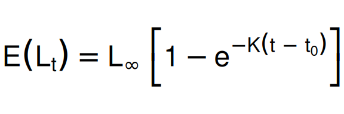

An R function to return a predicted length from this equation when given
an age (or ages) and values for the three parameters can be created with
[`makeGrowthFun()`](https://fishr-core-team.github.io/FSA/reference/makeGrowthFun.md)
using the same `type=` and `pname=`[³](#fn3) as used in
[`showGrowthFun()`](https://fishr-core-team.github.io/FSA/reference/showGrowthFun.md).
The result from
[`makeGrowthFun()`](https://fishr-core-team.github.io/FSA/reference/makeGrowthFun.md)
should be assigned to an object, which will then be the name of the R
function to predict lengths.

``` r
vb1 <- makeGrowthFun(type="von Bertalanffy",pname="Typical")
```

For example, `vb1()` can now be used to predict the mean length for
age-2 fish assuming $L_{\infty} = 450$, $K = 0.3$, and $t_{0} = -0.5$.

``` r
vb1(2,Linf=450,K=0.3,t0=-0.5)
#> [1] 237.4351
```

The default result from
[`makeGrowthFun()`](https://fishr-core-team.github.io/FSA/reference/makeGrowthFun.md)
creates a function where the three parameters can be given to the first
parameter name as a numeric vector with values for all three parameters.
For example, the mean length at age-2 can also be predicted with the
following.

``` r
vb1(2,Linf=c(450,0.3,-0.5))
#> [1] 237.4351
```

Note that using the vector of parameter values in this way is useful (as
will be demonstrated below) but also requires that the values are
provided in the order that the function expects them. This order can be
seen by displaying the function code and noting the order of the
arguments in the function declaration.

``` r
vb1
#> function (t, Linf, K = NULL, t0 = NULL) 
#> {
#>     if (length(Linf) == 3) {
#>         t0 <- Linf[[3]]
#>         K <- Linf[[2]]
#>         Linf <- Linf[[1]]
#>     }
#>     Linf * (1 - exp(-K * (t - t0)))
#> }
#> <bytecode: 0x56223ef30e28>
#> <environment: namespace:FSA>
```

The same `vb1()` function can be used to predict mean lengths for a
number of ages (e.g., ages 2 to 12 below).

``` r
vb1(2:12,Linf=450,K=0.3,t0=-0.5)
#>  [1] 237.4351 292.5280 333.3419 363.5775 385.9767 402.5703 414.8633 423.9701
#>  [9] 430.7165 435.7145 439.4170
```

These examples of predicted mean lengths at age given the growth
function equation and parameter values are fairly trivial. The most
useful aspect of the saved function will be its use in fitting data to
the growth function.

Non-linear model fitting algorithms require starting values for the
function parameters. Starting values for the parameters of most common
fisheries growth functions can be obtained using
[`findGrowthStarts()`](https://fishr-core-team.github.io/FSA/reference/findGrowthStarts.md).
To demonstrate
[`findGrowthStarts()`](https://fishr-core-team.github.io/FSA/reference/findGrowthStarts.md)
suppose that length-at-age (recorded as an annual age) are available in
`tlV` and `age` of the `GrowthData1` data.frame,[⁴](#fn4), a snapshot of
which is shown below.

``` r
peek(GrowthData1,n=10,which=c("tlV","age"))
#>     tlV age
#> 1    61   0
#> 20  220   2
#> 40  245   2
#> 60  319   3
#> 80  278   3
#> 99  341   4
#> 119 384   5
#> 139 419   7
#> 159 462   9
#> 179 435  15
```

[`findGrowthStarts()`](https://fishr-core-team.github.io/FSA/reference/findGrowthStarts.md)
requires a formula of the form `length~age`,[⁵](#fn5) a corresponding
data.frame in `data=`, and the same `type=` and `pname=`[⁶](#fn6) as in
[`showGrowthFun()`](https://fishr-core-team.github.io/FSA/reference/showGrowthFun.md)
and
[`makeGrowthFun()`](https://fishr-core-team.github.io/FSA/reference/makeGrowthFun.md).
For example, starting values for the `GrowthData1` data and the typical
parameterization of the von Bertalanffy growth function are obtained
below. The results of
[`findGrowthStarts()`](https://fishr-core-team.github.io/FSA/reference/findGrowthStarts.md)
should be assigned to an object for later use.[⁷](#fn7)

``` r
( vsv1 <- findGrowthStarts(tlV~age,data=GrowthData1,
                           type="von Bertalanffy",pname="Typical") )
#>        Linf           K          t0 
#> 454.4806075   0.2974555  -0.4752262
```

There may be times when the provided starting values are non-sensical
(you may get a warning message) or they do not lead to model convergence
when fitting the non-linear regression to data. In these instances it
may be useful to view a quick diagnostic plot of how the model evaluated
at the starting values “fits” the data. Such a plot can be made by
including `plot=TRUE` in
[`findGrowthStarts()`](https://fishr-core-team.github.io/FSA/reference/findGrowthStarts.md).[⁸](#fn8)

``` r
vsv1 <- findGrowthStarts(tlV~age,data=GrowthData1,
                         type="von Bertalanffy",pname="Typical",plot=TRUE)
```

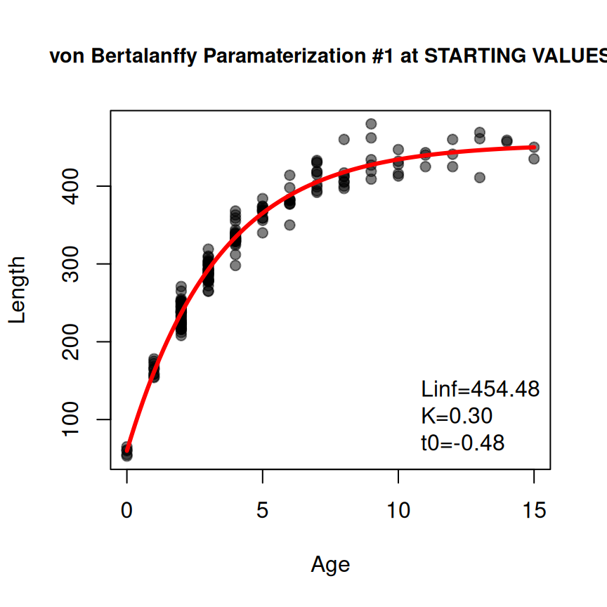

Additionally, it may be useful to “fix” some starting values at values
of your choice (rather than having them determined from the data). Such
parameters can be included in a **NAMED** vector given to `fixed=` in
[`findGrowthStarts()`](https://fishr-core-team.github.io/FSA/reference/findGrowthStarts.md).
For example, the `K` parameter is fixed at 0.5 below.[⁹](#fn9)

``` r
vsv2 <- findGrowthStarts(tlV~age,data=GrowthData1,
                         type="von Bertalanffy",pname="Typical",plot=TRUE,
                         fixed=c(K=0.5))
```

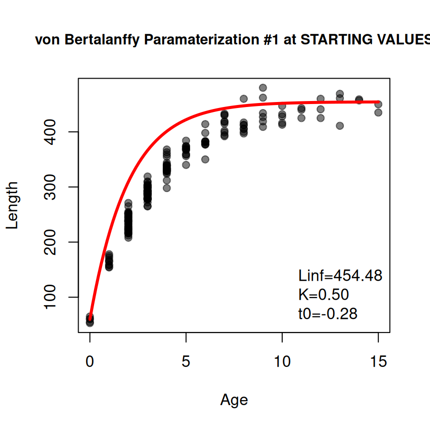

Data are then fit to the non-linear growth model using
[`nls()`](https://rdrr.io/r/stats/nls.html) with a formula that has
`length` on the left-hand-side and the specific growth function with the
specific `age` variable and model parameter names on the
right-hand-side, the associated data in `data=`, and the saved starting
values in `start=`.

``` r
resv1 <- nls(tlV~vb1(age,Linf,K,t0),data=GrowthData1,start=vsv1)
```

The estimated values of the parameters are extracted from this saved
[`nls()`](https://rdrr.io/r/stats/nls.html) object with
[`coef()`](https://rdrr.io/r/stats/coef.html) and likelihood profile
confidence intervals are extracted with
[`confint()`](https://rdrr.io/r/stats/confint.html). The two can be
column-bound together for a concise report.

``` r
cbind(Est=coef(resv1),confint(resv1))
#> Waiting for profiling to be done...
#>              Est        2.5%       97.5%
#> Linf 456.0374952 448.7004147 463.7915414
#> K      0.2932701   0.2761202   0.3107616
#> t0    -0.4848237  -0.5943280  -0.3845776
```

Displaying the fitted function with the data can be done in a variety of
ways. Below is a quick plot that uses
[`ggplot()`](https://ggplot2.tidyverse.org/reference/ggplot.html) along
with
[`stat_function()`](https://ggplot2.tidyverse.org/reference/geom_function.html).
The important things to note about
[`stat_function()`](https://ggplot2.tidyverse.org/reference/geom_function.html)
are that the R function for the growth function is given in `fun=` and
the parameter estimates are extracted with
[`coef()`](https://rdrr.io/r/stats/coef.html) and given to the first
parameter name (i.e,. `Linf` in this example) inside a list that is
assigned to `args=`.

``` r
ggplot(data=GrowthData1,aes(y=tlV,x=age)) +
  geom_point(size=2.5,alpha=0.2) +
  scale_y_continuous(name="Total Length (mm)",limits=c(0,NA)) +
  scale_x_continuous(name="Age (years)") +
  stat_function(fun=vb1,args=list(Linf=coef(resv1)),linewidth=1,color="blue") +
  theme_bw()
```

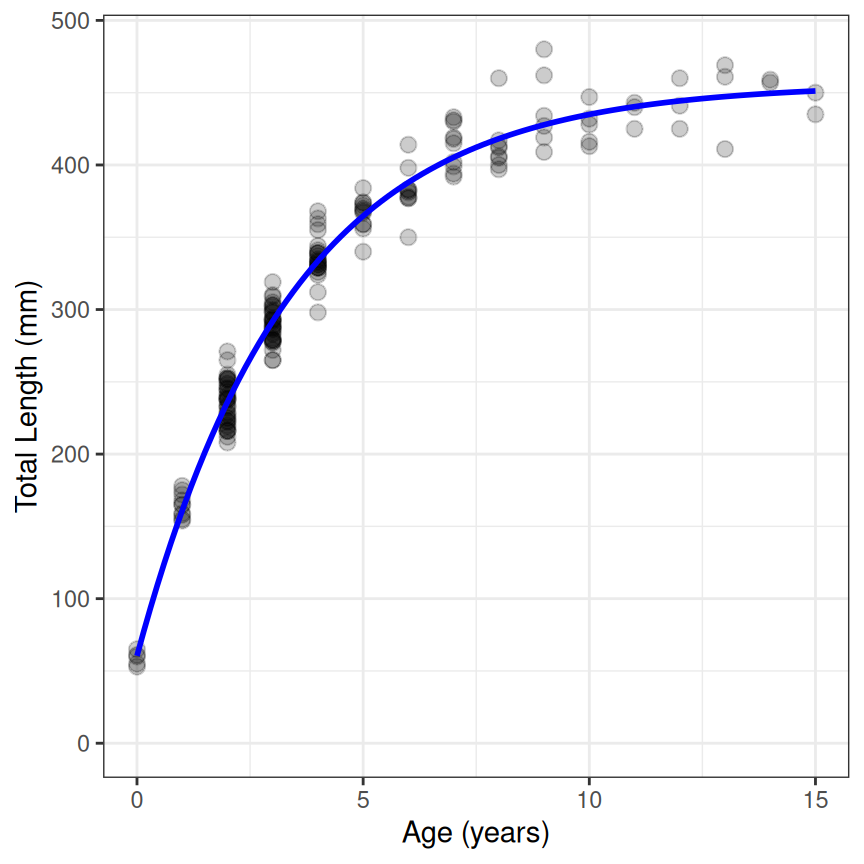

An equation of the growth function with the parameter estimates can be
created with
[`showGrowthFun()`](https://fishr-core-team.github.io/FSA/reference/showGrowthFun.md)
using the same `type=` and `pname=` as before, but also including the
saved [`nls()`](https://rdrr.io/r/stats/nls.html) object in `fit=`. The
object returned from
[`showGrowthFun()`](https://fishr-core-team.github.io/FSA/reference/showGrowthFun.md)
can be used in
[`annotate()`](https://ggplot2.tidyverse.org/reference/annotate.html)
from `ggplot2` to add the equation to the plot. Note that `parse=TRUE`
is required in
[`annotate()`](https://ggplot2.tidyverse.org/reference/annotate.html) to
convert the text returned from
[`showGrowthFun()`](https://fishr-core-team.github.io/FSA/reference/showGrowthFun.md)
into an expression, `size=` controls the size of the text, and `x=` and
`y=` are used to place (usually with trial-and-error) the equation.

``` r
ggplot(data=GrowthData1,aes(y=tlV,x=age)) +
  geom_point(size=2.5,alpha=0.2) +
  scale_y_continuous(name="Total Length (mm)",limits=c(0,NA)) +
  scale_x_continuous(name="Age (years)") +
  stat_function(fun=vb1,args=list(Linf=coef(resv1)),linewidth=1,color="blue") +
  annotate(geom="text",
           label=showGrowthFun(type="von Bertalanffy",pame="Typical",fit=resv1),
           parse=TRUE,size=5,x=9,y=50) +
  theme_bw()
```

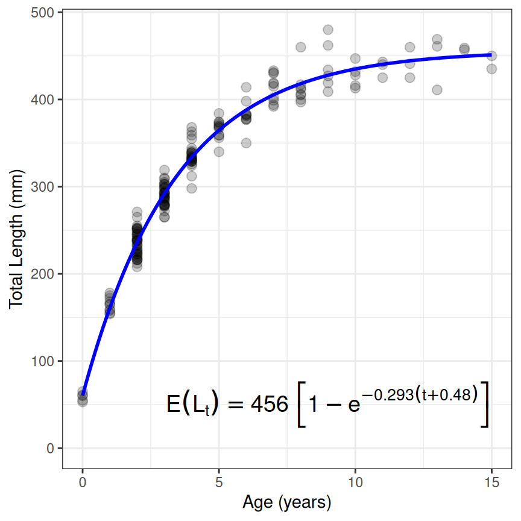

## Second Example – Richards

The same general process works for other growth models. For example,
suppose that your data suggests an inflection point in the growth
trajectory so you want to fit the second parameterization of the
Richards function, which has four parameters of $L_{\infty}$, $k$,
$t_{0}$, and $b$. The same general workflow is illustrated below noting
that `type="Richards"` and `param=2` is used, but those are assigned to
objects outside the function to save some repetitive typing.[¹⁰](#fn10)

``` r
typ <- "Richards"
prm <- 2
rich1 <- makeGrowthFun(type=typ,param=prm)
rsv1 <- findGrowthStarts(tlR~age,data=GrowthData1,type=typ,param=prm,plot=TRUE)
```

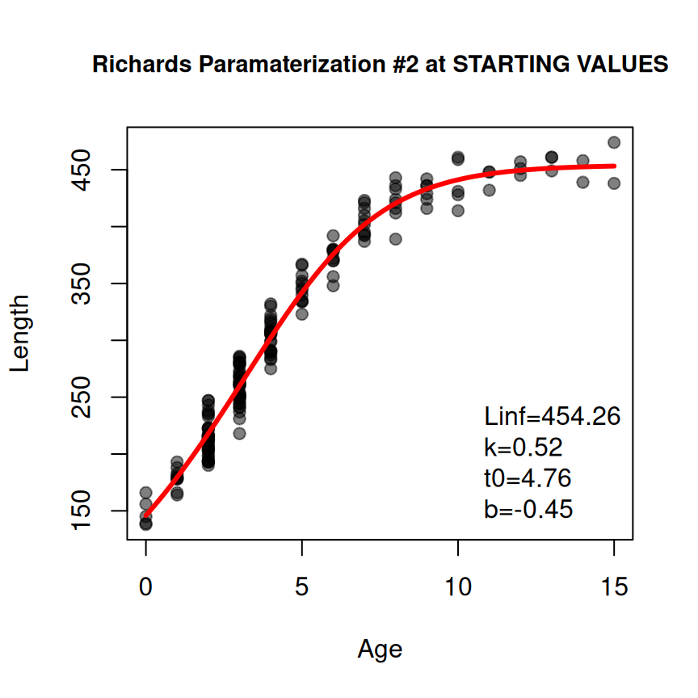

``` r
resr1 <- nls(tlR~rich1(age,Linf,k,t0,b),data=GrowthData1,start=rsv1)
cbind(Est=coef(resr1),confint(resr1))
#> Waiting for profiling to be done...
#>              Est        2.5%       97.5%
#> Linf 452.9499118 444.5152186 462.5688222
#> k      0.5309684   0.4303097   0.6601910
#> t0     4.7527545   3.4644030   5.5695013
#> b     -0.4424650  -0.7086819  -0.3007673
```

``` r
ggplot(data=GrowthData1,aes(y=tlR,x=age)) +
  geom_point(size=2.5,alpha=0.2) +
  scale_y_continuous(name="Total Length (mm)",limits=c(0,NA)) +
  scale_x_continuous(name="Age (years)") +
  stat_function(fun=rich1,args=list(Linf=coef(resr1)),linewidth=1,color="blue") +
  annotate(geom="text",label=showGrowthFun(type=typ,param=prm,fit=resr1),
           parse=TRUE,size=5,x=9,y=50) +
  theme_bw()
```

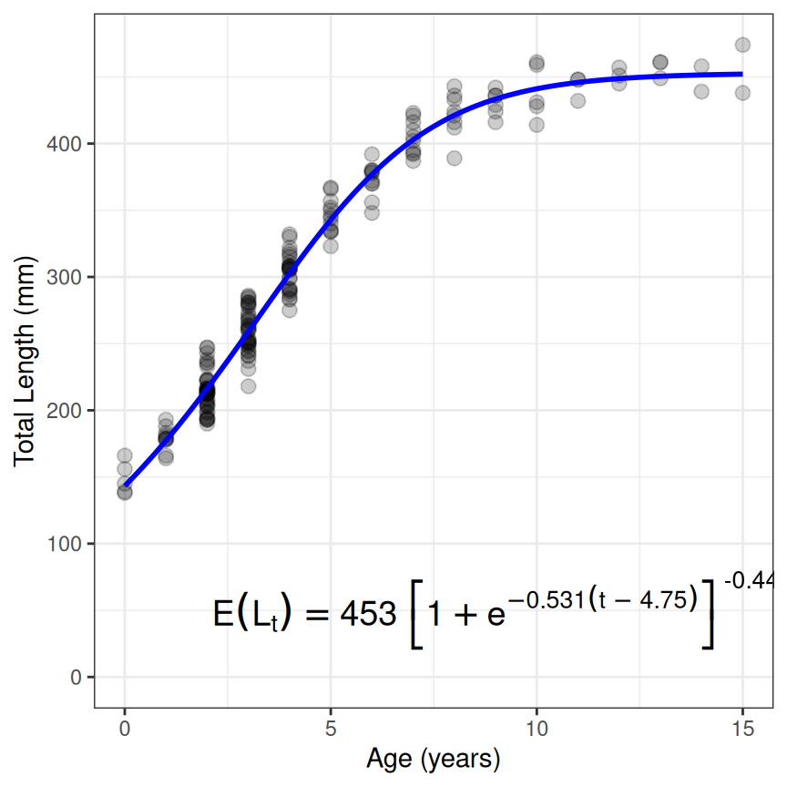

## Third Example – Francis von Bertalanffy

Some growth models require certain values to be set at constant values.
For example, the Francis parameterization of the von Bertalanffy
function has three parameters ($L_{1}$, $L_{2}$, and $L_{3}$) that are
estimated mean lengths at three specified ages. Two of those ages –
$t_{1}$ and $t_{3}$ – are set by the user for defining $L_{1}$ and
$L_{3}$. The third parameter ($L_{2}$) is defined at the time that is
the average of $t_{1}$ and $t_{3}$. Ages for $t_{1}$ and $t_{3}$ must be
set in a **NAMED** vector (`cv2` below) given to `constvals=` in
[`findGrowthStarts()`](https://fishr-core-team.github.io/FSA/reference/findGrowthStarts.md),
the function created by
[`makeGrowthFun()`](https://fishr-core-team.github.io/FSA/reference/makeGrowthFun.md),
and
[`showGrowthFun()`](https://fishr-core-team.github.io/FSA/reference/showGrowthFun.md).
The rest of the workflow is the similar to above (noting that `type=`
and `pname=` are adjusted). However note that the Francis model uses a
“where” clause to simplify the look of the equation, which can result in
a long (i.e., wide) equation. The use of `stackWhere=TRUE` in
[`showGrowthFun()`](https://fishr-core-team.github.io/FSA/reference/showGrowthFun.md)
will “stack” the “where” clause underneath the main equation to narrow
(but make taller) the equation. Further note that the result from
[`showGrowthFun()`](https://fishr-core-team.github.io/FSA/reference/showGrowthFun.md)
was saved to an object here just to reduce clutter in the plotting code.

``` r
typ <- "von Bertalanffy"
prm <- "Francis"
vb2 <- makeGrowthFun(type=typ,pname=prm)
cv2 <- c(t1=0,t3=12)
rsv2 <- findGrowthStarts(tlV~age,data=GrowthData1,type=typ,pname=prm,
                         constvals=cv2,plot=TRUE)
```

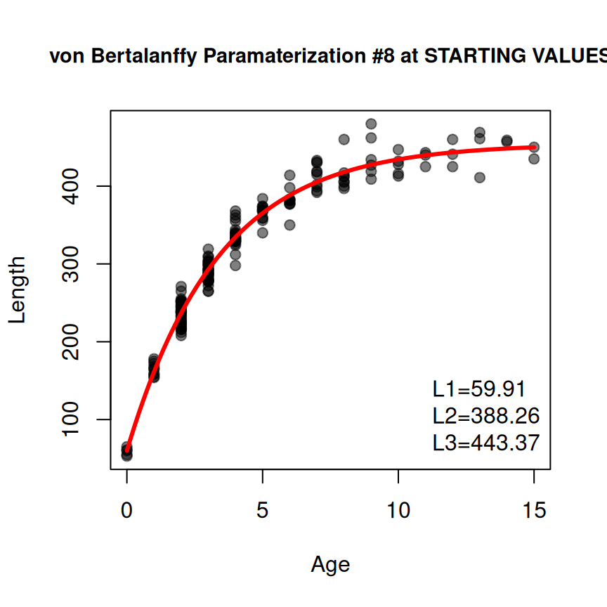

``` r
resv2 <- nls(tlV~vb2(age,L1,L2,L3,t1=cv2),data=GrowthData1,start=rsv2)
cbind(Est=coef(resv2),confint(resv2))
#> Waiting for profiling to be done...
#>          Est      2.5%     97.5%
#> L1  60.44277  50.41095  70.34143
#> L2 387.95159 385.04537 390.85403
#> L3 444.31932 438.84385 449.85716
```

``` r
eqn <- showGrowthFun(type=typ,pname=prm,fit=resv2,constvals=cv2,stackWhere=TRUE)

ggplot(data=GrowthData1,aes(y=tlV,x=age)) +
  geom_point(size=2.5,alpha=0.2) +
  scale_y_continuous(name="Total Length (mm)",limits=c(0,NA)) +
  scale_x_continuous(name="Age (years)") +
  stat_function(fun=vb2,args=list(L1=coef(resv2),t1=cv2),linewidth=1,color="blue") +
  annotate(geom="text",label=eqn,parse=TRUE,size=4.5,x=10,y=50) +
  theme_bw()
```

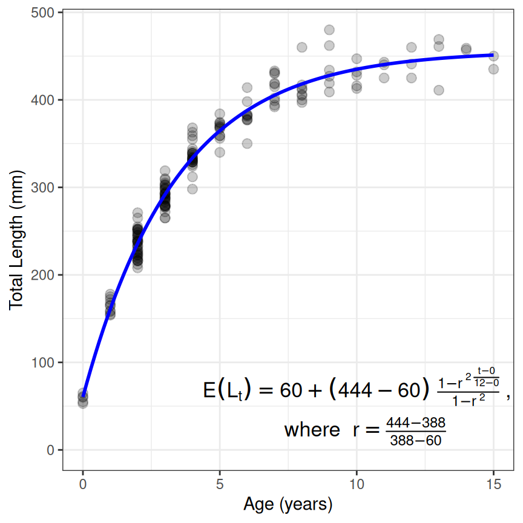

## Fourth Example – Somer’s (Seasonal) von Bertalanffy

The Somer’s parameterization of the von Bertalanffy can be used to model
data where ages are fractional parts of the year, often referred to as
seasonal length-at-age data. The process for fitting this model is very
similar to above as illustrated below.[¹¹](#fn11)

``` r
type <- "von Bertalanffy"
prm <- "Somers"
vb3 <- makeGrowthFun(type=typ,pname=prm)
rsv3 <- findGrowthStarts(tlS~age,data=GrowthData2,type=typ,pname=prm,plot=TRUE)
```

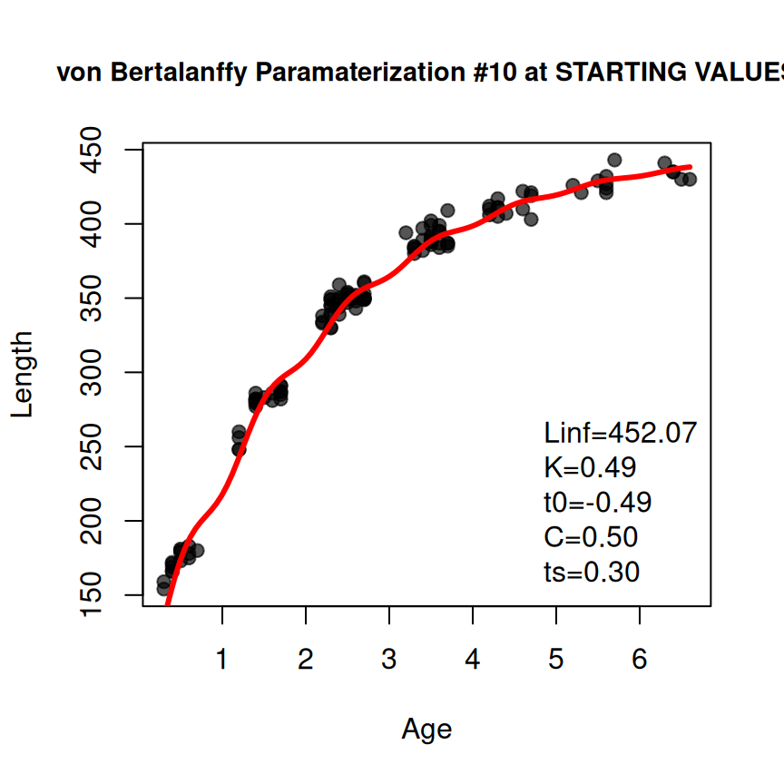

``` r
resv3 <- nls(tlS~vb3(age,Linf,K,t0,C,ts),data=GrowthData2,start=rsv3)
cbind(Est=coef(resv3),confint(resv3))
#> Waiting for profiling to be done...
#>              Est         2.5%       97.5%
#> Linf 450.3311672 446.26959271 454.5753258
#> K      0.5052008   0.48680724   0.5239582
#> t0    -0.4183363  -0.55965206  -0.1697775
#> C      0.9398083   0.73548569   1.1529083
#> ts     0.1145216   0.07858732   0.1420780
```

``` r
eqn <- showGrowthFun(type=typ,pname=prm,fit=resv3,stackWhere=TRUE)

ggplot(data=GrowthData2,aes(y=tlS,x=age)) +
  geom_point(size=2.5,alpha=0.4) +
  scale_y_continuous(name="Total Length (mm)",limits=c(0,NA)) +
  scale_x_continuous(name="Age (years)") +
  stat_function(fun=vb3,args=list(Linf=coef(resv3)),linewidth=1,color="blue") +
  annotate(geom="text",label=eqn,parse=TRUE,size=4,x=4,y=50) +
  theme_bw()
```

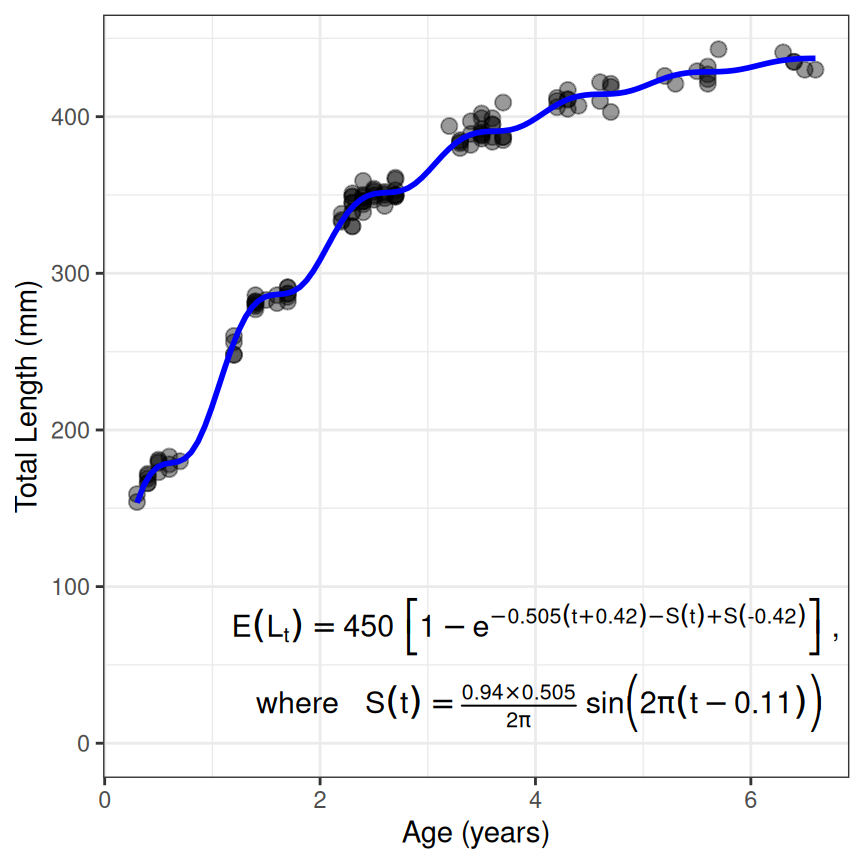

## Fifth Example – Fabens (Tag-Recapture) von Bertalanffy

Using parameterizations of the von Bertalanffy for tag-recapture
data[¹²](#fn12) follows a similar workflow, but with a few different
details. First, some of the parameterizations use the change in length
as the response variable, whereas others use the length at recapture.
The first example here will use Fabens parameterization which uses the
change-in-length as the response variable.

Before continuing, this example will use the data in `GrowthData3`,
which is shown below and has variables that are the unique tag number of
the fish (`tag`), the total length at marking/tagging (`tlM`) and
subsequent recapture (`tlR`), time-at-large (time between marking and
recapture; `deltat`), and change in length (`deltaL`).

``` r
peek(GrowthData3,n=10)
#>      tag tlM tlR    deltat deltaL
#> 1      5 240 335 2.1022151     95
#> 14   109 285 367 2.1137812     82
#> 28   218 329 389 2.0448716     60
#> 43   366 240 328 1.9849893     88
#> 57   470 295 335 1.0461305     40
#> 71   564 290 326 0.9713158     36
#> 85   670 164 291 2.0017494    127
#> 100  757 334 365 1.0982425     31
#> 114  901 389 404 1.1392284     15
#> 128 1000 385 405 1.1120293     20
```

The primary explanatory variable in tag-recaptures models in `FSA` is
the time-at-large but the length at marking is also required in many
models. Thus, both time-at-large and length at marking will appear in
the function created by
[`makeGrowthFun()`](https://fishr-core-team.github.io/FSA/reference/makeGrowthFun.md).
For example, a function to predict the change in length from the
time-at-large and length at marking for the Fabens parameterization is
created below.

``` r
typ <- "von Bertalanffy"
prm <- "Fabens"
( vb4 <- makeGrowthFun(type=typ,pname=prm) )
#> function (dt, Lm, Linf, K = NULL) 
#> {
#>     if (length(Linf) == 2) {
#>         K <- Linf[[2]]
#>         Linf <- Linf[[1]]
#>     }
#>     (Linf - Lm) * (1 - exp(-K * dt))
#> }
#> <bytecode: 0x56223ff096e0>
#> <environment: namespace:FSA>
```

For example, the predicted change in length for times-at-large of 1, 2,
and 3 years and a length-at-marking of 300 mm (and assuming
$L_{\infty}$=450 and $K$=0.3) is obtained with the following.

``` r
vb4(1:3,300,Linf=450,K=0.3)
#> [1] 38.87727 67.67825 89.01455
```

Or the predicted change in length of a 1 year time-at-large for fish
with lengths-at-marking of 100, 200, and 300 mm is obtained with the
following.

``` r
vb4(1,c(100,200,300),Linf=450,K=0.3)
#> [1] 90.71362 64.79544 38.87727
```

With this understanding the rest of workflow is similar to above with
the excecption that the formula in
[`findGrowthStarts()`](https://fishr-core-team.github.io/FSA/reference/findGrowthStarts.md)
will be of the form `deltaL~deltat+Lm`.

``` r
rsv4 <- findGrowthStarts(deltaL~deltat+tlM,data=GrowthData3,type=typ,pname=prm)
resv4 <- nls(deltaL~vb4(deltat,tlM,Linf,K),data=GrowthData3,start=rsv4)
cbind(Est=coef(resv4),confint(resv4))
#> Waiting for profiling to be done...
#>              Est        2.5%       97.5%
#> Linf 446.3107842 440.4914317 452.5043374
#> K      0.3091659   0.2943062   0.3245036
```

Unfortunately, there is not one single graphic that can be used to
summarize the results from fitting the growth model to tag-recapture
data. The code below won’t be discussed in detail, though a few
important details will be highlighted. First, this plot leverages the
fact that the marking and tagging sampling events were generally
conducted annually so that the times-at-large were very nearly exactly
1, 2, or 3 years. Second, a data.frame is created that uses the fitted
model to predict the change-in-length for those three times-at-large at
the minimum observed length-at-marking and the estimated $L_{\infty}$.
These predictions will be used to place three fitted lines, one for each
rough time-at-large, on the scatterplot of change-in-length versus
length-at-marking. Only two points are needed for the lines here because
Fabens model assumes a linear decline in change-in-length with increase
length-at-marking for each time-at-large.

``` r
pdf <- data.frame(tlM=rep(c(min(GrowthData3$tlM),coef(resv4)[["Linf"]]),each=3),
                  deltat=rep(c(1,2,3),times=2))
pdf$deltaL <- vb4(pdf$deltat,pdf$tlM,Linf=coef(resv4)[["Linf"]],K=coef(resv4)[["K"]])
pdf
#>        tlM deltat    deltaL
#> 1 158.0000      1  76.67366
#> 2 158.0000      2 132.95664
#> 3 158.0000      3 174.27168
#> 4 446.3108      1   0.00000
#> 5 446.3108      2   0.00000
#> 6 446.3108      3   0.00000
```

The plotting routine looks more complicated here because the original
data.frame is used to place the observed points on the graph, but the
predicted data.frame is used to place the lines. In addition, the
`deltat` variable is converted to a factor so that a discrete number of
colors would be used. Finally note the use of
[`showGrowthFun()`](https://fishr-core-team.github.io/FSA/reference/showGrowthFun.md)
and
[`annotate()`](https://ggplot2.tidyverse.org/reference/annotate.html) to
add the equation to the plot.

``` r
eqn <- showGrowthFun(type=typ,pname=prm,fit=resv4)

ggplot() +
  geom_point(data=GrowthData3,mapping=aes(x=tlM,y=deltaL,col=as.factor(round(deltat,0))),
             size=2.5,alpha=0.4) +
  geom_line(data=pdf,mapping=aes(x=tlM,y=deltaL,col=as.factor(deltat)),linewidth=1) +
  scale_y_continuous(name="Change in Length from Marking (mm)",limits=c(0,NA)) +
  scale_x_continuous(name="Total Length-at-Marking (mm)") +
  labs(color="Years-at-Large") +
  annotate(geom="text",label=eqn,parse=TRUE,size=4.2,x=350,y=165) +
  theme_bw() +
  theme(legend.position="inside",
        legend.position.inside=c(0.85,0.5))
```

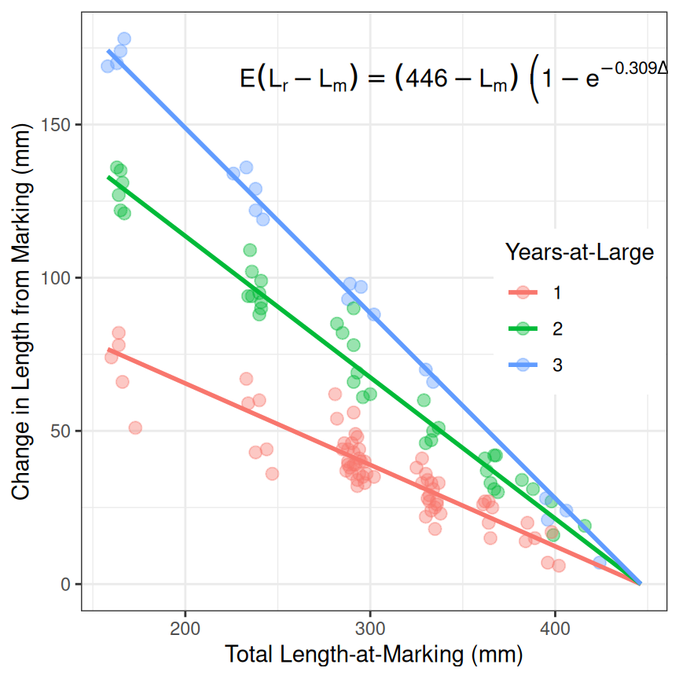

## Exploring Model Parameters

Understanding the meaning of parameters in the growth functions is
important for properly modeling fish growth. One way to learn about the
meaning of a parameter is to plot the growth function while varying one
parameter and holding the other parameters constant. The growth
functions created by
[`makeGrowthFun()`](https://fishr-core-team.github.io/FSA/reference/makeGrowthFun.md)
will aid in this process.

For simplicity, a `ggplot2` theme was created that modified
[`theme_bw()`](https://ggplot2.tidyverse.org/reference/ggtheme.html) to
remove the grid lines and move the legend inside of the plot panel.

``` r
theme_grow <- function() {
  theme_bw() +
    theme(panel.grid=element_blank(),
          legend.position="inside",
          legend.position.inside=c(1,0),
          legend.justification.inside=c(1.1,0))
}
```

In this example, the parameter for the instantaneous growth ($g_{i}$) at
the inflection point (\$t_i) in the second parameterization of the
Gompertz growth function will be explored. An R function for this
parameterization is created below with
[`makeGrowthFun()`](https://fishr-core-team.github.io/FSA/reference/makeGrowthFun.md)
and the corresponding generic equation is created with
[`showGrowthFun()`](https://fishr-core-team.github.io/FSA/reference/showGrowthFun.md).
Note that `parse=TRUE` is used in
[`showGrowthFun()`](https://fishr-core-team.github.io/FSA/reference/showGrowthFun.md)
here because the equation is going to form the title in the ggplot which
requires an expression (returned when `parse=TRUE`) rather than a string
that it will parse.

``` r
f <- makeGrowthFun(type="Gompertz",param=2)
feqn <- showGrowthFun(type="Gompertz",param=2,parse=TRUE)
```

A data.frame is then created that has all combinations of a sequence of
ages over which to show the growth function and values for both the
parameter that varies and those that are held constant. In the example
below, age will be a sequence from -0.5 to 15 in steps of
0.5[¹³](#fn13), $L_{\infty}$ will be held constant at 450, $t_{i}$ (age
at the inflection point) will be held constant at 3, and $g_{i}$ will
vary from 0.1 to 0.6 in steps of 0.1. Length is then computed from these
ages and parameter values using the growth function created above (i.e.,
`f()`). Finally, the variable with the parameter that varied is
converted to a factor so that the plot created next will use a discrete
rather than continuous number of colors.

``` r
tmp <- expand.grid(Age=seq(-0.5,15,0.5),
                   Linf=450,gi=seq(0.1,0.6,0.1),ti=3) |>
  dplyr::mutate(Length=f(Age,Linf,gi,ti),
                gi=as.factor(gi)) 
peek(tmp,n=6)
#>      Age Linf  gi ti   Length
#> 1   -0.5  450 0.1  3 108.8728
#> 38   2.0  450 0.2  3 132.6673
#> 77   5.5  450 0.3  3 280.5862
#> 115  8.5  450 0.4  3 402.8017
#> 154 12.0  450 0.5  3 445.0286
#> 192 15.0  450 0.6  3 449.6642
```

These simulated data are then plotted using the parameter that varied to
denote `color`.

``` r
ggplot(data=tmp,mapping=aes(y=Length,x=Age,color=gi)) +
  geom_line(linewidth=1)+
  labs(title=feqn) +
  theme_grow()
```

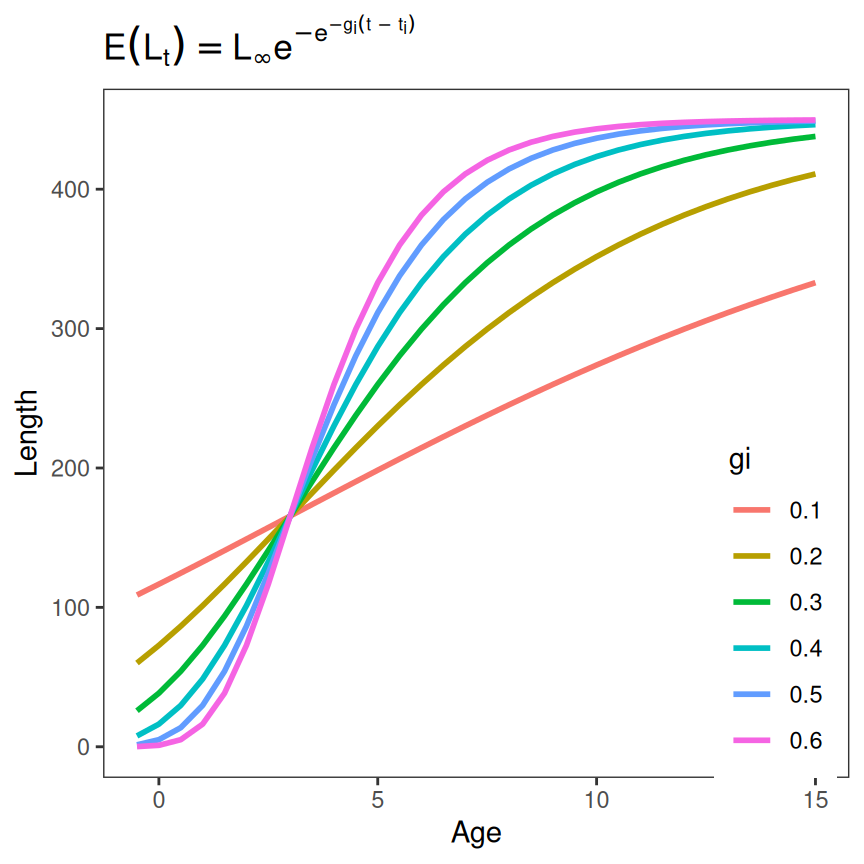

From here one can observe that each instance of this Gompertz function
has an infection point at age-3 and that the “rate of growth” at that
inflection point is greater as $g_{i}$ increases, making the growth
function look more “S-shaped.”

Of course, the method can be easily modified for another parameter.

``` r
tmp <- expand.grid(Age=seq(-0.5,15,0.5),
                   Linf=450,gi=0.5,ti=seq(1,6,1)) |>
  dplyr::mutate(Length=f(Age,Linf,gi,ti),
                ti=as.factor(ti)) 

ggplot(data=tmp,mapping=aes(y=Length,x=Age,color=ti)) +
  geom_line(linewidth=1)+
  labs(title=feqn) +
  theme_grow()
```

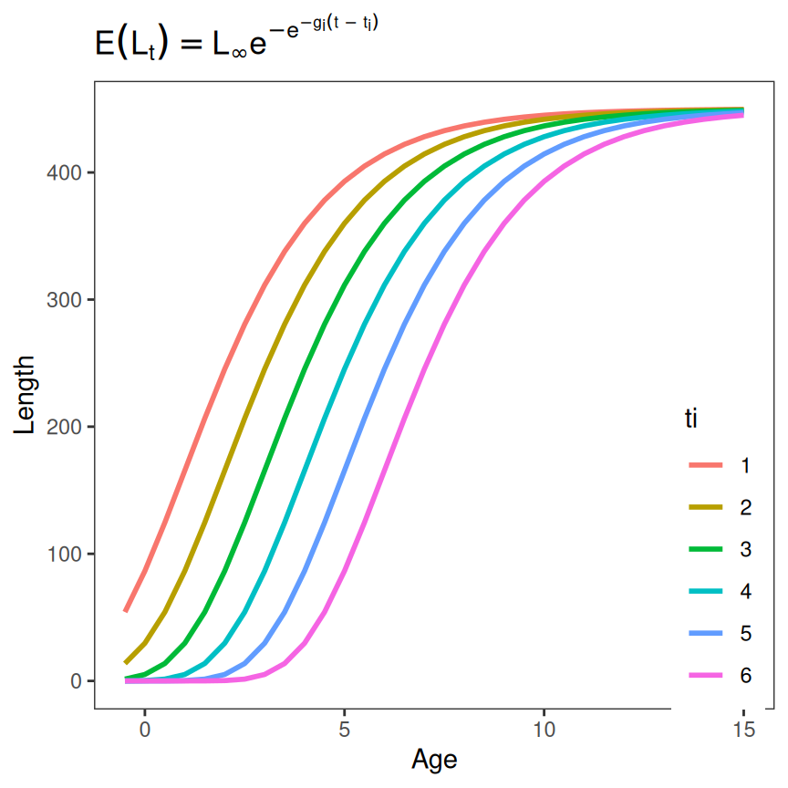

It is possible to change two parameters at once, though this can become
messy so it is best to vary the parameters at fewer values.

``` r
tmp <- expand.grid(Age=seq(-0.5,15,0.5),
                   Linf=450,gi=seq(0.3,0.6,0.1),ti=c(2,4)) |>
  dplyr::mutate(Length=f(Age,Linf,gi,ti),
                gi=as.factor(gi),
                ti=as.factor(ti)) 

ggplot(data=tmp,mapping=aes(y=Length,x=Age,color=gi,linetype=ti)) +
  geom_line(linewidth=1) +
  labs(title=feqn) +
  theme_grow()
```

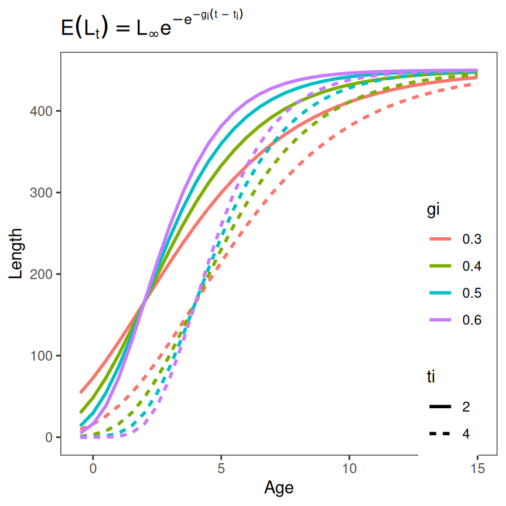

Finally, you can be more creative/instructive. For example, the
instantaneous growth rate can be estimated by dividing the difference in
successive log lengths by the difference in successive ages.

``` r
tmp <- expand.grid(Age=seq(0,6,0.01),
                   Linf=450,gi=seq(0.3,0.6,0.1),ti=3) |>
  dplyr::mutate(Length=f(Age,Linf,gi,ti),
                gi=as.factor(gi)) |>
  dplyr::mutate(est_g=c(diff(log(Length))/diff(Age),NA))
peek(tmp,n=6)
#>       Age Linf  gi ti    Length     est_g
#> 1    0.00  450 0.3  3  38.46099 0.7367752
#> 481  4.80  450 0.3  3 251.26278 0.1745625
#> 962  3.60  450 0.4  3 204.92001 0.3140227
#> 1442 2.39  450 0.5  3 115.88781 0.6766195
#> 1923 1.19  450 0.6  3  23.26260 1.7721188
#> 2404 6.00  450 0.6  3 381.43814        NA
```

The plot of the estimated instantaneous growth rates against age, zoomed
in to focus on the inflection points, with reference lines at $t_{i}$
and the $g_{i}$ illustrates that $g_{i}$ is indeed the instantaneous
growth rate at the inflection point.

``` r
ggplot(data=tmp,mapping=aes(y=est_g,x=Age,color=gi)) +
  geom_line(linewidth=1) +
  labs(title=feqn) +
  theme_grow() + theme(legend.position.inside=c(1,0.5)) +
  scale_y_continuous(limits=c(0,1)) +
  scale_x_continuous(limits=c(1,5)) +
  geom_hline(yintercept=c(0.3,0.4,0.5,0.6),linetype="dashed") +
  geom_vline(xintercept=3,linetype="dashed")
#> Warning: Removed 976 rows containing missing values or values outside the scale range
#> (`geom_line()`).
```

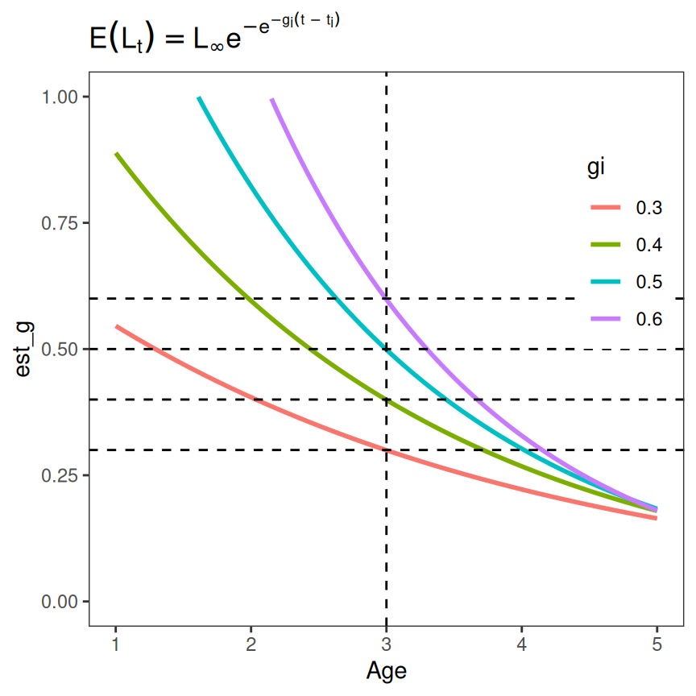

------------------------------------------------------------------------

1.  Or `param=1`

2.  `cex=1.5` is used to make the text larger.

3.  Or `param=`

4.  This data.frame is available in `FSA`.

5.  This is true for length-at-age models, but will differ for
    tag-recapture data, which will be shown later.

6.  Or `param=`

7.  The leading and trailing parentheses below force the result to also
    be shown when it is assigned to an object.

8.  As a general rule use `plot=TRUE` to immediately examine the
    relative “fit” of the starting values, rather than waiting for an
    “issue” to appear.

9.  Fixing $K$ looks inappropriate in this example.

10. Also note that the response variable was changed to `tlR` as these
    are lengths in `GrowthData1` that exhibited an inflection point.

11. Noting that the `tlS` from `GrowthData2` is used here as is contains
    a seasonal length-at-age example.

12. Generally, require observed lengths at marking, observed lengths at
    recapture or the change in observed length from marking, and the
    time-at-large (time difference between marking and recapture).

13. Smaller steps will make the growth function look smoother.
