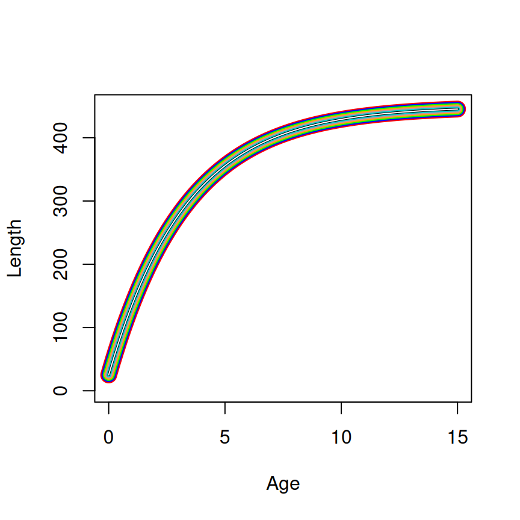
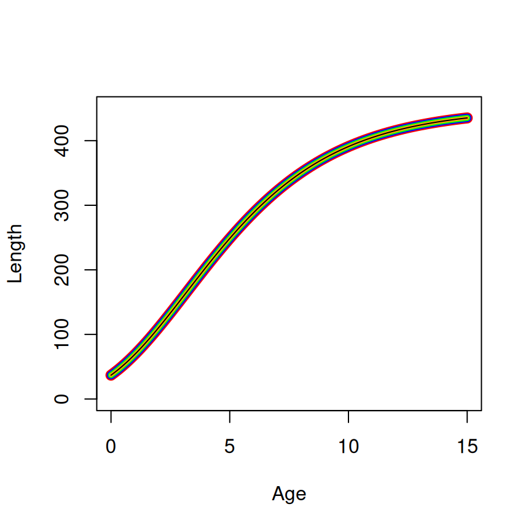
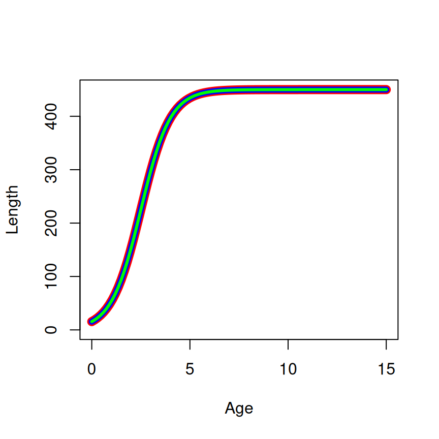
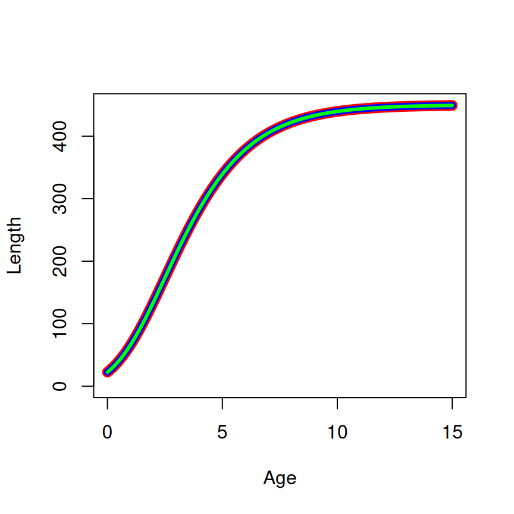
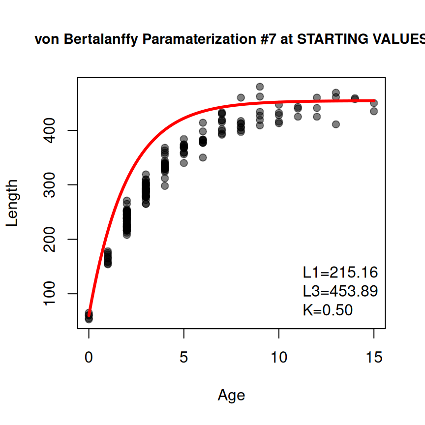

# Deriving Starting Values for Growth Functions in FSA

## Introduction

The most common growth models used in fisheries, such as von
Bertalanffy, Gompertz, logistic, and Richards, are non-linear models.
Computer functions used to estimate parameters for these models require
“starting values” to initiate the parameter search algorithm. Previous
versions of `FSA` (v0.9.6 and lower) used *ad hoc* methods to estimate
starting values for parameterizations of the von Bertalanffy function,
but did not provide any method to derive starting values for the ohter
common growth functions.

Several “self-starting” non-linear models are provided in R, with three
of these found in base R and one in an add-on package that correspond to
the common fisheries growth models. These functions provide starting
values that are based on robust theory. Herein, I show how the starting
values provided by these self-starting functions can be used to derive
starting values for the common parameterizations of the common growth
models used in fisheries. I will conclude by briefly demonstrating a new
function in `FSA` that will provide the starting values demonstrated
here.

  

## Derivation of Starting Values

### von Bertalanffy Length-at-Age

`FSA` provides a wide variety of von Bertalanffy parameterizations for
modeling simple length-at-age data ([Table 1](#tbl-VBparams1)).[¹](#fn1)

| param | Equation                                                                                                                                                                 |
|:-----:|:-------------------------------------------------------------------------------------------------------------------------------------------------------------------------|
|   1   | $E\left( L_{t} \right) = L_{\infty}\left( 1 - e^{-K{(t - t_{0})}} \right)$                                                                                               |
|   2   | $E\left( L_{t} \right) = L_{\infty} - \left( L_{\infty} - L_{0} \right)\ e^{-Kt}$                                                                                        |
|   3   | $E\left( L_{t} \right) = \frac{\omega}{K}\left( 1 - e^{-K{(t - t_{0})}} \right)$                                                                                         |
|   4   | $E\left( L_{t} \right) = L_{\infty} - \left( L_{\infty} - L_{0} \right)\ e^{-\frac{\omega}{L_{\infty}}t}$                                                                |
|   5   | $E\left( L_{t} \right) = L_{\infty}\left( 1 - e^{-log{(2)}\frac{t - t_{0}}{t_{50} - t_{0}}} \right)$                                                                     |
|   6   | $E\left( L_{t} \right) = L_{r} + \left( L_{\infty} - L_{r} \right)\ e^{-e^{-K{(t - t_{r})}}}$                                                                            |
|   7   | $E\left( L_{t} \right) = L_{1} + \left( L_{3} - L_{1} \right)\frac{1 - e^{-K{(t - t_{1})}}}{1 - e^{-K{(t_{3} - t_{1})}}}$                                                |
|   8   | $E\left( L_{t} \right) = L_{1} + \left( L_{3} - L_{1} \right)\frac{1 - r^{2\frac{t - t_{1}}{t_{3} - t_{1}}}}{1 - r^{2}}$ where $r = \frac{L_{3} - L_{2}}{L_{2} - L_{1}}$ |

Table 1: Parameterizations of the von Bertalanffy growth equation for
length-at-age data available in `FSA`.

  

The response variable, $L$, is length and the explanatory variable, $t$
is age. Parameters in these growth functions are:

- $L_{\infty}$ = asymptotic mean length
- $K$ = exponential rate of approach to $L_{\infty}$
- $t_{0}$ = nuisance parameter that is the hypothetical time/age when
  mean length is 0
- $L_{0}$ = mean length at age-0 (i.e., hatching or birth)
- $\omega$ = growth rate near $t_{0}$
- $t_{50}$ = age when half of $L_{\infty}$ is reached
- $t_{r}$ = mean age at $L_{r}$ (*sometimes this is a constant*)
- $L_{r}$ = mean length at $t_{r}$ (*sometimes this is a constant*)
- $L_{1}$ = mean length at $t_{1}$ (generally a younger age)
- $L_{2}$ = mean length at $t_{2}$ (generally an intermediate age)
- $L_{3}$ = mean length at $t_{3}$ (generally a older age)

Constant values (i.e., set by the user) are:

- $t_{r}$ = mean age at $L_{r}$ (*sometimes this is a parameter*)
- $L_{r}$ = mean length at $t_{r}$ (*sometimes this is a parameter*)
- $t_{1}$ = a younger (generally) age
- $t_{2}$ = an age halfway between $t_{1}$ and $t_{2}$
- $t_{3}$ = an older (generally) age

  

[`SSasymp()`](https://rdrr.io/r/stats/SSasymp.html) is a self-starting
function[²](#fn2) to fit an “asymptotic regression” function to data.
The parameterization for this function is[³](#fn3)

$$Y = \text{Asym} + \left( \text{R0} - \text{Asym} \right)\ e^{-e^{\text{lrc} \times \text{input}}}$$

where $Y$ and $\text{input}$ are the response and explanatory variables,
respectively, $\text{Asym}$ is a parameter for the horizontal (i.e.,
$Y$) asymptote, $\text{R0}$ is a parameter related to the value of $Y$
at $X = 0$, and $lrc$ is a “parameter representing the natural logarithm
of the rate constant.”

In growth (in length) modeling, $Y$ is $L$ (for length); $\text{input}$
is $t$ (for time as measured by age); $\text{Asym}$ is clearly
$L_{\infty}$, the asympotic mean length; and $\text{R0}$ is clearly
$L_{0}$, the mean length at $t = 0$ (i.e., the y-intercept). Thus, at
this point, the R “asymptotic regression” function can be re-written for
the purposes of growth modeling as

$$L = L_{\infty} - \left( L_{\infty} - L_{0} \right)\ e^{-e^{\text{lrc} \times t}}$$

If we move $\text{lrc}$ off of the log scale by defining
$K = e^{\text{lrc}}$, we can further write this function as

$$L = L_{\infty} - \left( L_{\infty} - L_{0} \right)\ e^{-Kt}\qquad(1)$$

[Equation 1](#eq-rSSasymp) is **exactly** the second parameterization of
the von Bertalanffy growth function in `FSA`.[⁴](#fn4) Thus, the
starting values produced by
[`SSasymp()`](https://rdrr.io/r/stats/SSasymp.html) can be used directly
to find starting values for the second parameterization of the von
Bertalanffy growth function in `FSA` ([Table 2](#tbl-VBstarts1)). Indeed
these values can be used for all parameterizations that have
$L_{\infty}$, $L_{0}$, and $K$. Starting values for other parameters in
other parameterizations are derived from these values as shown below.

A starting value for $t_{0}$, the “hypothetical time when the mean
length is zero”, is derived by setting $L = 0$ in
[Equation 1](#eq-rSSasymp) and solving for $t$.

$$\begin{aligned}
0 & {= L_{\infty} - \left( L_{\infty} - L_{0} \right)\ e^{-Kt}} \\
L_{\infty} & {= \left( L_{\infty} - L_{0} \right)\ e^{-Kt}} \\
\frac{L_{\infty}}{L_{\infty} - L_{0}} & {= e^{-Kt}} \\
{log\left( \frac{L_{\infty}}{L_{\infty} - L_{0}} \right)} & {= -K} \\
{-\frac{log\left( \frac{L_{\infty}}{L_{\infty} - L_{0}} \right)}{K}} & {= t}
\end{aligned}$$

The $\omega$ parameter was introduced into the fisheries growth modeling
literature as $\omega = KL_{\infty}$ (Gallucci and Quin 1979[⁵](#fn5)).
Thus, a starting value for $\omega$ is simply the product of the
starting values for $K$ and $L_{\infty}$.

A starting value for $t_{50}$ is derived (most easily) by solving the
first parameterization equation for $t$ when
$\frac{L}{L_{\infty}} = \frac{1}{2}$.

$$\begin{aligned}
L & {= L_{\infty}\left( 1 - e^{-K{(t - t_{0})}} \right)} \\
\frac{L}{L_{\infty}} & {= 1 - e^{-K{(t - t_{0})}}} \\
\frac{1}{2} & {= 1 - e^{-K{(t_{50} - t_{0})}}} \\
e^{-K{(t_{50} - t_{0})}} & {= \frac{1}{2}} \\
{-K\left( t_{50} - t_{0} \right)} & {= log\left( \frac{1}{2} \right)} \\
{t_{50} - t_{0}} & {= \frac{log(2)}{K}} \\
t_{50} & {= t_{0} + \frac{log(2)}{K}}
\end{aligned}$$

A starting value for $L_{r}$ (i.e., mean length at time $t_{r}$) can be
found by simply plugging $t_{r}$ into any parameterization[⁶](#fn6) and
solving for $L$. This strategy generalizes to find starting values for
$L_{1}$, $L_{2}$, and $L_{3}$.

A starting value for $t_{r}$ can be found by plugging $L_{r}$ for $L$
into any of the parameterizations and solving for $t$.

  

| Param | $L_{\infty}$  | $L_{0}$     | $K$              | $\omega$      | $t_{0}$                                                              | $t_{50}$                   |
|:-----:|---------------|-------------|------------------|---------------|----------------------------------------------------------------------|----------------------------|
|   1   | $\text{Asym}$ |             | $e^{\text{lrc}}$ |               | $-\frac{log\left( \frac{L_{\infty}}{L_{\infty} - L_{0}} \right)}{K}$ |                            |
|   2   | $\text{Asym}$ | $\text{R0}$ | $e^{\text{lrc}}$ |               |                                                                      |                            |
|   3   |               |             | $e^{\text{lrc}}$ | $KL_{\infty}$ | $-\frac{log\left( \frac{L_{\infty}}{L_{\infty} - L_{0}} \right)}{K}$ |                            |
|   4   | $\text{Asym}$ | $\text{R0}$ |                  | $KL_{\infty}$ |                                                                      |                            |
|   5   | $\text{Asym}$ |             |                  |               | $-\frac{log\left( \frac{L_{\infty}}{L_{\infty} - L_{0}} \right)}{K}$ | $t_{0} + \frac{log(2)}{K}$ |
|   6   | $\text{Asym}$ |             | $e^{\text{lrc}}$ |               |                                                                      |                            |
|   7   |               |             | $e^{\text{lrc}}$ |               |                                                                      |                            |

Table 2: Conversion from
[`SSasymp()`](https://rdrr.io/r/stats/SSasymp.html) parameters
($\text{Asym}$, $\text{R0}$, and $\text{lrc}$) to parameters for the
common von Bertalanffy parameterizations used to model fish growth in
`FSA`. Note that parameterizations 6, 7, and 8 have other parameters not
shown in this table (but described in the main text).

  

The equivalency of the parameterizations and the starting values across
parameterizations is shown in [Figure 1](#fig-vbstarts).



Figure 1: Parameterizations 1-8 of the von Bertalanffy growth functions
evaluated at starting values derived from the parameters of `SSasymp`
($\text{Asym}$=450, $\text{R0}$=25, and $lrc$=-1.2). The linewidth
decreases from the first to last parameterization (and the color
differs) to show how the curves are plotted on top of each other.

  

The ninth parameterization ([Table 3](#tbl-VBparams2)) of the von
Bertalanffy model in `FSA` is a so-called “double von Bertalanffy”
model.[⁷](#fn7)

| param | Equation                                                                                                                                                                           |
|:-----:|:-----------------------------------------------------------------------------------------------------------------------------------------------------------------------------------|
|   9   | $E\left( L_{t} \right) = L_{\infty}\frac{\left( 1 - e^{-K_{2}{(t - t_{0})}} \right)\left( 1 + e^{-b{(t - t_{0} - a)}} \right)}{\left( 1 + e^{ab} \right)^{-\frac{K_{2}K_{1}}{b}}}$ |

Table 3: Parameterizations of the von Bertalanffy growth equation for
length-at-age data available in `FSA`.

Starting values for the ninth parameterization (i.e., the “double”) von
Bertalanffy growth model have not been developed in `FSA`. Starting
values for this parameterization will have to be developed by other
means.

  

### von Bertalanffy Seasonal Length-at-Age

There are also several parameterizations of the von Bertalanffy model
that include a seasonal component in the model for when age is not
recorded annually ([Table 4](#tbl-VBparams3)).

  

| param | Equation                                                                                                                                                                                                                        |
|:-----:|:--------------------------------------------------------------------------------------------------------------------------------------------------------------------------------------------------------------------------------|
|  10   | $E\left( L_{t} \right) = L_{\infty}\left\lbrack 1 - e^{-K{(t - t_{0})} - S{(t)} + S{(t_{0})}} \right\rbrack$ where $S(t) = \frac{CK}{2\pi}sin\left( 2\pi\left( t - t_{s} \right) \right)$                                       |
|  11   | $E\left( L_{t} \right) = L_{\infty}\left\lbrack 1 - e^{-K{(t - t_{0})} - R{(t)} + R{(t_{0})}} \right\rbrack$ where $R(t) = \frac{CK}{2\pi}sin\left( 2\pi(t - WP + 0.5) \right)$                                                 |
|  12   | $E\left( L_{t} \right) = L_{\infty}\left( 1 - e^{-K\prime{(t\prime - t_{0})} - V{(t\prime)} + V{(t_{0})}} \right)$ where $V(t) = \frac{K\prime(1 - NGT)}{2\pi}sin\left( \frac{2\pi}{(1 - NGT)}\left( t - t_{s} \right) \right)$ |

Table 4: Parameterizations of the von Bertalanffy growth equation for
length-at-age data with a seasonal component available in `FSA`.

  

New parameters in these growth functions are:[⁸](#fn8)

- $C$ = proportional growth depression at “winter peak”
- $t_{s}$ = time from $t = 0$ until first growth oscillation begins
- $WP$ = “winter peak” (point of slowest growth)
- $K\prime$ = exponential rate of approach to $L_{\infty}$ during the
  growth period
- $NGT$ = length of “no-growth period”

  

Starting values for $L_{\infty}$, $K$, and $t_{0}$ are derived as if the
data were recorded as *annual* lengths-at-age. Starting values for the
other parameters are defined *ad hoc* as follows.

- $C$ set at an intermediate value of 0.5
- $t_{s}$ set at 0.3, a likely fraction of the year for growth to start
  in the northern hemisphere.
- $WP$ set at 0.8, because $WP = t_{2} + 0.5$
- $NGT$ set at 0.3, a likely fraction of the year for “no growth” in the
  northern hemisphere.
- $K\prime$ set at $\frac{K}{(1 - NGT)}$, assuming that $K$ was only
  over the “growth period” (i.e., $1 - NGT$).

Starting values for the seasonal growth models are much less tested than
those for annual growth models. Please consider them carefully.

### von Bertalanffy Tag-Recapture

Still other parameterizations of the von Bertalanffy model are used with
tag-recapture data ([Table 5](#tbl-VBparams4)).

| param | Equation                                                                                                                                                                                                                                                                                                                                                                                                     |
|:-----:|:-------------------------------------------------------------------------------------------------------------------------------------------------------------------------------------------------------------------------------------------------------------------------------------------------------------------------------------------------------------------------------------------------------------|
|  13   | $E\left( L_{r} - L_{m} \right) = \left( L_{\infty} - L_{m} \right)\left( 1 - e^{-K\delta t} \right)$                                                                                                                                                                                                                                                                                                         |
|  14   | $E\left( L_{r} \right) = L_{m} + \left( L_{\infty} - L_{m} \right)\left( 1 - e^{-K\delta t} \right)$                                                                                                                                                                                                                                                                                                         |
|  15   | $E\left( L_{r} - L_{m} \right) = \left( L_{\infty} + \beta\left( L_{m} - {\bar{L}}_{m} \right) - L_{m} \right)\left( 1 - e^{-K\delta t} \right)$                                                                                                                                                                                                                                                             |
|  16   | $E\left( L_{r} - L_{m} \right) = \left( \alpha + \beta L_{m} \right)\left( 1 - e^{-K\delta t} \right)$                                                                                                                                                                                                                                                                                                       |
|  17   | $E\left( L_{r} \right) = L_{m} + \left( \alpha + \beta L_{m} \right)\left( 1 - e^{-K\delta t} \right)$                                                                                                                                                                                                                                                                                                       |
|  18   | $E\left( L_{r} - L_{m} \right) = \left\lbrack \frac{L_{2}g_{1} - L_{1}g_{2}}{g_{1} - g_{2}} - L_{m} \right\rbrack\left\lbrack 1 - \left( 1 + \frac{g_{1} - g_{2}}{L_{1} - L_{2}} \right)^{\delta t} \right\rbrack$                                                                                                                                                                                           |
|  19   | $E\left( L_{r} - L_{m} \right) = \left\lbrack \frac{L_{2}g_{1} - L_{1}g_{2}}{g_{1} - g_{2}} - L_{m} \right\rbrack\left\lbrack 1 - \left( 1 + \frac{g_{1} - g_{2}}{L_{1} + L_{2}} \right)^{t_{2} - t_{1} + S_{2} - S_{1}} \right\rbrack$ with $S_{1} = u\text{sin}\left( \frac{2\pi\left( t_{1} - w \right)}{2\pi} \right)$ and $S_{2} = u\text{sin}\left( \frac{2\pi\left( t_{2} - w \right)}{2\pi} \right)$ |

Table 5: Parameterizations of the von Bertalanffy growth equation for
length at tag and recapture data available in `FSA`.

The response variable is generally the change in length (i.e., growth
increment) from time of tagging to time of recapture, $L_{r} - L_{m}$.
Some models are parameterized to have $L_{m}$ on the right-hand-side
though. The explanatory variable is the change in time between the time
of tagging and recapture, $\delta t$.

New parameters in these growth functions are:

- $\beta$ = a measure of individual fish variability.
- $\alpha$ = a nuisance parameter related to $L_{\infty}$ and an
  individual’s $L_{m}$.
- $g_{1}$ = mean annual growth rate at the (relatively small) reference
  length $L_{1}$.
- $g_{2}$ = mean annual growth rate at the (relatively large) reference
  length $L_{2}$.
- $u$ = describes “the extent of seasonality” ($u$=0 is no seasonality).
- $w$ = is the time of year when growth rates are maximum.

  

Starting values for (most of) these parameters were developed with the
following *ad hoc* procedure.

- Regress (linear) observed annual growth rate (i.e.,
  $\frac{\delta L}{\delta t}$ or $\frac{L_{r} - L_{m}}{t_{r} - t_{m}}$)
  on observed length-at-marking (i.e., $L_{m}$).
- Use this model to predict annual growth rates ($g_{1}$ and $g_{2}$) at
  $L_{1}$ and $L_{2}$. \[$L_{1}$ and $L_{2}$ are chosen by the user in
  parameterization 18, but are set in `FSA` at the 10th and 90th
  percentiles of observed $L_{m}$ for the other parameterizations.\]
- Use these results in
  $L_{\infty} = \frac{L_{2}g_{1} - L_{1}g_{2}}{L1 - L2}$ and
  $K = -log\left\lbrack 1 + \frac{g_{1} - g_{2}}{L_{1} - L_{2}} \right\rbrack$
  from Francis (1988).

In the Wang models $\beta$ is 0 if there is no individual variation in
growth. In my experience a starting value for $\beta$ near 0, but no 0,
is usually sufficient. `FSA` defaults to use $\beta = 0.1$ as a starting
value. A starting value for $\alpha$ of $L_{\infty} - {\bar{L}}_{m}$ is
used by noting that if $\beta = 0$ then parameterizations 15 and 16 are
equal when $\alpha = L_{\infty} - L_{m}$. An average $\alpha$ can be
estimated by using ${\bar{L}}_{m}$ for $L_{m}$. These starting values
for $\alpha$ and $\beta$ have not been rigorously tested.

> **Warning**
>
> Starting values for parameterization 19 have not been developed for
> `FSA`. Starting values for this parameterization will have to be
> developed by other means.

  

### Gompertz Length-at-Age

`FSA` provides several parameterizations of the Gompertz function for
modeling simple length-at-age data ([Table 6](#tbl-Gompparams1)).

| param | Equation                                                                        |
|:-----:|:--------------------------------------------------------------------------------|
|   1   | $E\left( L_{t} \right) = L_{\infty}e^{-e^{a_{1} - g_{i}t}}$                     |
|   2   | $E\left( L_{t} \right) = L_{\infty}e^{-e^{-g_{i}{(t - t_{i})}}}$                |
|   3   | $E\left( L_{t} \right) = L_{0}e^{a_{2}{(1 - e^{-g_{i}t})}}$                     |
|   4   | $E\left( L_{t} \right) = L_{\infty}e^{-a_{2}e^{-g_{i}t}}$                       |
|   5   | $E\left( L_{t} \right) = L_{\infty}e^{-\frac{1}{g_{i}}e^{-g_{i}{(t - t_{0})}}}$ |

Table 6: Parameterizations of the Gompertz growth equation for
length-at-age data available in `FSA`.

  

New parameters in these growth functions are:[⁹](#fn9)

- $t_{i}$ = age at the inflection point
- $g_{i}$ = instantaneous growth rate at $t_{i}$, the inflection point
- $a_{1}$, $a_{2}$ = nuisance parameters with no biological meaning

  

[`SSgompertz()`](https://rdrr.io/r/stats/SSgompertz.html) is a
self-starting function[¹⁰](#fn10) to fit a Gompertz function to data.
The parameterization for this function is[¹¹](#fn11)

$$Y = \text{Asym}\ e^{-b_{2}b_{3}^{X}}$$

where $Y$ and $X$ are the response and explanatory variables,
respectively, $\text{Asym}$ is a parameter for the horizontal (i.e.,
$Y$) asymptote, $b_{2}$ is a parameter related to the value of $Y$ at
$X = 0$, and $b_{3}$ is a “parameter related to the scale of the
x-axis.”

In growth (in length) modeling, $Y$ is $L$ (for length), $X$ is $t$ (for
time as measured by age), and $\text{Asym}$ is clearly $L_{\infty}$.
Thus, at this point, the Gompertz function from
[`SSgompertz()`](https://rdrr.io/r/stats/SSgompertz.html) can be
re-written for the purposes of growth modeling as

$$L = L_{\infty}e^{-b_{2}b_{3}^{t}}\qquad(2)$$

It is not immediately clear how $b_{2}$ and $b_{3}$ relate to parameters
from common parameterizations of the Gompertz functions used to model
fish growth. These will be explained below.

The first parameterization differs from [Equation 2](#eq-rSSgomp) only
in the exponent of $e$ (after the negative). This part of the equation
for the first parameterization can be rearranged as follows

$$\begin{aligned}
 & e^{(a - g_{i}t)} \\
 & {e^{a_{1}}e^{-g_{i}t)}}
\end{aligned}$$

If $b_{2} = e^{a_{1}}$ and $b_{3} = e^{-g_{i}}$ then this simplified
exponent is the same as the exponent in [Equation 2](#eq-rSSgomp). Thus,
$g_{i} = -log\left( b_{3} \right)$ and $a_{1} = log\left( b_{2} \right)$
(and, of course, $L_{\infty} = \text{Asym}$).

Similarly, the second parameterization also only differs from
[Equation 2](#eq-rSSgomp) after the negative in the exponent of $e$.
Again, simplifying this exponent gives

$$\begin{aligned}
 & e^{-g_{i}{(t - t_{i})}} \\
 & e^{-g_{i}t + g_{i}t_{i}} \\
 & {e^{-g_{i}t}e^{g_{i}t_{i}}} \\
 & {e^{g_{i}t_{i}}e^{-g_{i}t}}
\end{aligned}$$

If $b_{2} = e^{g_{i}t_{i}}$ and $b_{3} = e^{-g_{i}}$ then this
simplified exponent is the same as the exponent in
[Equation 2](#eq-rSSgomp). Thus, $g_{i} = -log\left( b_{3} \right)$ and
$t_{i} = \frac{log\left( b_{2} \right)}{g_{i}}$.

There is no asymptote in the third parameterizations, so the entire
function must be manipulated to show equivalence to
[Equation 2](#eq-rSSgomp).

$$\begin{aligned}
 & {L_{0}e^{a_{2}{(1 - e^{-g_{i}t})}}} \\
 & {L_{0}e^{a_{2} - a_{2}e^{-g_{i}t}}} \\
 & {L_{0}e^{a_{2}}e^{-a_{2}e^{-g_{i}t}}} \\
 & 
\end{aligned}$$ If $L_{\infty} = L_{0}e^{a_{2}}$, $b_{2} = a_{2}$, and,
again, $b_{3} = e^{-g_{i}}$ then the third parameterization is
equivalent to [Equation 2](#eq-rSSgomp). Thus, $a_{2} = b_{2}$,
$g_{i} = -log\left( b_{3} \right)$, and
$L_{0} = \frac{L_{\infty}}{e^{a_{2}}}$.

The fourth parameterization is equal to [Equation 2](#eq-rSSgomp) if
$b_{2} = a_{2}$ and $b_{3} = e^{-g_{i}}$. Thus, again $a_{2} = b_{2}$
and $g_{i} = -log\left( b_{3} \right)$ (and, of course,
$L_{\infty} = \text{Asym}$).

The fifth parameterization includes $t_{0}$ which appears to be defined,
as in the von Bertalanffy function, as the age where the mean length is
zero (i.e., the x-intercept). The three-parameter Gompertz function used
here has a lower asymptote at $L = 0$ and, thus, does not have an
x-intercept. Therefore, it is not exactly clear what $t_{0}$ is.
However, again, the exponent of $e$ (after the negative) of the fifth
parameterizations can be rearranged

$$\begin{aligned}
 & {\frac{1}{g_{i}}e^{-g_{i}{(t - t_{0})}}} \\
 & {\frac{1}{g_{i}}e^{-g_{i}t + g_{i}t_{0}}} \\
 & {\frac{1}{g_{i}}e^{-g_{i}t}e^{g_{i}t_{0}}} \\
 & {\frac{1}{g_{i}}e^{g_{i}t_{0}}e^{-g_{i}t}}
\end{aligned}$$

If $b_{2} = \frac{1}{g_{i}}e^{g_{i}t_{0}}$ and $b_{3} = e^{-g_{i}}$,
then this simplified exponent is the same as the exponent in
[Equation 2](#eq-rSSgomp). Thus, $g_{i} = -log\left( b_{3} \right)$ and
$t_{0} = \frac{log\left( b_{2}g_{i} \right)}{g_{i}}$ (and, of course,
$L_{\infty} = \text{Asym}$).

These findings are summarized in [Table 7](#tbl-gompStarts).

  

| param | $L_{\infty}$  | $L_{0}$                        | $g_{i}$                    | $t_{i}$                                 | $t_{0}$                                      | $a_{\text{\#}}$           |
|:-----:|---------------|--------------------------------|----------------------------|-----------------------------------------|----------------------------------------------|---------------------------|
|   1   | $\text{Asym}$ |                                | $-log\left( b_{3} \right)$ |                                         |                                              | $log\left( b_{2} \right)$ |
|   2   | $\text{Asym}$ |                                | $-log\left( b_{3} \right)$ | $\frac{log\left( b_{2} \right)}{g_{i}}$ |                                              |                           |
|   3   |               | $\frac{L_{\infty}}{e^{b_{2}}}$ | $-log\left( b_{3} \right)$ |                                         |                                              | $b_{2}$                   |
|   4   | $\text{Asym}$ |                                | $-log\left( b_{3} \right)$ |                                         |                                              | $b_{2}$                   |
|   5   | $\text{Asym}$ |                                | $-log\left( b_{3} \right)$ |                                         | $\frac{log\left( b_{2}g_{i} \right)}{g_{i}}$ |                           |

Table 7: Conversion from
[`SSgompertz()`](https://rdrr.io/r/stats/SSgompertz.html) parameters
($\text{Asym}$, $b_{2}$, and $b_{3}$) to parameters for the common
Gompertz parameterizations used to model fish growth in `FSA`.

  

The equivalency of the parameterizations and the starting values across
parameterizations is shown in [Figure 2](#fig-gompstarts).



Figure 2: All parameterizations of the Gompertz growth functions
evaluated at starting values derived from the parameters of `SSgompertz`
($\text{Asym}$=450, $b_{2}$=2.5, and $b_{3}$=0.75). The linewidth
decreases from the first to last parameterization (and the color
differs) to show how the curves are plotted on top of each other.

  

### Gompertz Tag-Recapture

Still other parameterizations of the Gompertz model are used with
tag-recapture data ([Table 8](#tbl-Gompparams2)).

| param | Equation                                                                                                                     |
|:-----:|:-----------------------------------------------------------------------------------------------------------------------------|
|   6   | $E\left( L_{r} - L_{m} \right) = L_{\infty}\left\lbrack \frac{L_{m}}{L_{\infty}} \right\rbrack^{e^{-g_{i}\delta t}} - L_{m}$ |
|   7   | $E\left( L_{r} \right) = L_{\infty}\left\lbrack \frac{L_{m}}{L_{\infty}} \right\rbrack^{e^{-g_{i}\delta t}}$                 |

Table 8: Parameterizations of the Gompertz growth equation for length at
tag and recapture data available in `FSA`.

  

> **Warning**
>
> Starting values for the tag-recapture growth models have not been
> developed for `FSA`. Starting values for these parameterizations will
> have to be developed by other means.

  

### Logistic Length-at-Age

`FSA` provides several parameterizations of the logistic function for
modeling simple length-at-age data ([Table 9](#tbl-Logisparams1)).

| param | Equation                                                                                                     |
|:-----:|:-------------------------------------------------------------------------------------------------------------|
|   1   | $E\left( L_{t} \right) = \frac{L_{\infty}}{1 + e^{-g_{-\infty}{(t - t_{i})}}}$                               |
|   2   | $E\left( L_{t} \right) = \frac{L_{\infty}}{1 + ae^{-g_{-\infty}t}}$                                          |
|   3   | $E\left( L_{t} \right) = \frac{L_{0}L_{\infty}}{L_{0} + \left( L_{\infty} - L_{0} \right)e^{-g_{-\infty}t}}$ |

Table 9: Parameterizations of the logistic growth equation for
length-at-age data available in `FSA`.

  

The response variable, $L$, is the mean length and the explanatory
variable, $t$ is age. Parameters in these growth functions
are:[¹²](#fn12)

- $g_{-\infty}$ is the instantaneous growth rate at $t = -\infty$
- $a$ = nuisance parameters with no biological meaning

  

[`SSlogis()`](https://rdrr.io/r/stats/SSlogis.html) is a self-starting
function[¹³](#fn13) to fit a logistic function to data. The
parameterization for this function is[¹⁴](#fn14)

$$Y = \frac{\text{Asym}}{1 + e^{\frac{\text{xmid} - \text{input}}{\text{scal}}}}$$

where $Y$ and $\text{input}$ are the response and explanatory variables,
respectively, $\text{Asym}$ is a parameter for the horizontal (i.e.,
$Y$) asymptote, $xmid$ is a parameter for the value of $X$ at the
inflection point, and $scal$ is a “parameter on the input axis.”

In growth (in length) modeling, $Y$ is $L$ (for length), $\text{input}$
is $t$ (for time as measured by age), and $\text{Asym}$ is clearly
$L_{\infty}$. Most likely $xmid$ is $t_{i}$, but it is not clear at this
point. Thus, at this point, the R logistic function can be re-written
for the purposes of growth modeling as

$$L = \frac{L_{\infty}}{1 + e^{\frac{\text{xmid} - t}{\text{scal}}}}\qquad(3)$$

Below I show how parameters in the common parameterizations of the
logistic function relate to $\text{xmid}$ and $\text{scal}$ (and,
possibly, $L_{\infty}$). It is easier to relate
[Equation 3](#eq-rSSlogis) to the Gompertz paramaeterizations if
[Equation 3](#eq-rSSlogis) is presented in the more verbose form of

$$\begin{aligned}
L & {= \frac{L_{\infty}}{1 + e^{\frac{\text{xmid} - t}{\text{scal}}}}} \\
 & {= \frac{L_{\infty}}{1 + e^{\frac{\text{xmid}}{\text{scal}} - \frac{t}{\text{scal}}}}} \\
 & {= \frac{L_{\infty}}{1 + e^{\frac{\text{xmid}}{\text{scal}}}e^{-\frac{t}{\text{scal}}}}}
\end{aligned}\qquad(4)$$

The only difference between the first parameterization and
[Equation 3](#eq-rSSlogis) is in the denominator after the “1+”. This
portion of the equation for the first parameterization can be rewritten
as

$$\begin{aligned}
 & e^{-g_{-\infty}{(t - t_{i})}} \\
 & e^{-g_{-\infty}t + g_{-\infty}t_{i}} \\
 & {e^{-g_{-\infty}t}e^{g_{-\infty}t_{i}}} \\
 & {e^{g_{-\infty}t_{i}}e^{-g_{-\infty}t}}
\end{aligned}$$

Comparing this to [Equation 4](#eq-rSSlogis1) it is apparent that
$g_{-\infty} = \frac{1}{\text{scal}}$ and
$g_{-\infty}t_{i} = \frac{\text{xmid}}{\text{scal}}$. The latter can be
simplified as

$$\begin{aligned}
{g_{-\infty}t_{i}} & {= \frac{\text{xmid}}{\text{scal}}} \\
t_{i} & {= \frac{\text{xmid}}{g_{-\infty}\text{scal}}} \\
t_{i} & {= \frac{\text{xmid}g_{-\infty}}{g_{-\infty}}} \\
t_{i} & {= \text{xmid}}
\end{aligned}$$

Thus, $\text{xmid}$ is the abcissa of the inflection point. Starting
values for the first parameterization are thus
$L_{\infty} = \text{Asym}$, $g_{-\infty} = \frac{1}{\text{scal}}$, and
$t_{i} = \text{xmid}$.

The second paramaterization only differs from [Equation 3](#eq-rSSlogis)
in the denominator after the “1+”, and no simplification is needed to
notice that $g_{-\infty} = \frac{1}{\text{scal}}$ and
$a = e^{\frac{\text{xmid}}{\text{scal}}}$.

The third parameterizations differs more substantively and requires more
work. First, rewrite the whole equation by dividing both the numerator
and denominator by $L_{0}$ to get

$$L = \frac{L_{\infty}}{1 + \frac{L_{\infty} - L_{0}}{L_{0}}e^{-g_{-\infty}t}}$$

In this form the only difference from [Equation 3](#eq-rSSlogis) is
again in the denominator after the “1+”. Again, by comparing this to
[Equation 4](#eq-rSSlogis1), it is apparent that
$g_{-\infty} = \frac{1}{\text{scal}}$ and
$\frac{L_{\infty} - L_{0}}{L_{0}} = e^{\frac{\text{xmid}}{\text{scal}}}$.
This second value is solved for $L_{0}$ with

$$\begin{aligned}
\frac{L_{\infty} - L_{0}}{L_{0}} & {= e^{\frac{\text{xmid}}{\text{scal}}}} \\
{L_{\infty} - L_{0}} & {= L_{0}e^{\frac{\text{xmid}}{\text{scal}}}} \\
L_{\infty} & {= L_{0} + L_{0}e^{\frac{\text{xmid}}{\text{scal}}}} \\
L_{\infty} & {= L_{0}\left( 1 + e^{\frac{\text{xmid}}{\text{scal}}} \right)} \\
\frac{L_{\infty}}{1 + e^{\frac{\text{xmid}}{\text{scal}}}} & {= L_{0}}
\end{aligned}$$

These findings are summarized in [Table 10](#tbl-logisstarts).

  

| param | $L_{\infty}$  | $L_{0}$                                                      | $g_{-\infty}$           | $t_{i}$       | $a$                                   |
|:-----:|---------------|--------------------------------------------------------------|-------------------------|---------------|---------------------------------------|
|   1   | $\text{Asym}$ |                                                              | $\frac{1}{\text{scal}}$ | $\text{xmid}$ |                                       |
|   2   | $\text{Asym}$ |                                                              | $\frac{1}{\text{scal}}$ |               | $e^{\frac{\text{xmid}}{\text{scal}}}$ |
|   3   | $\text{Asym}$ | $\frac{L_{\infty}}{1 + e^{\frac{\text{xmid}}{\text{scal}}}}$ | $\frac{1}{\text{scal}}$ |               |                                       |

Table 10: Conversion from
[`SSlogis()`](https://rdrr.io/r/stats/SSlogis.html) parameters
($\text{Asym}$, $\text{xmid}$, and $\text{scal}$) to parameters for the
common logistic parameterizations used to model fish growth in `FSA`.

  

The equivalency of the parameterizations and the starting values across
parameterizations is shown in [Figure 3](#fig-logisstarts).



Figure 3: All parameterizations of the logistic growth functions
evaluated at starting values derived from the parameters of `SSlogis`
($\text{Asym}$=450, $\text{xmid}$=2.5, and $\text{scal}$=0.75). The
linewidth decreases from the first to last parameterization (and the
color differs) to show how the curves are plotted on top of each other.

  

### Richards Length-at-Age

`FSA` provides several parameterizations of the Richards function for
modeling simple length-at-age data ([Table 11](#tbl-Richparams1)).

| param | Equation                                                                                                                                               |
|:-----:|:-------------------------------------------------------------------------------------------------------------------------------------------------------|
|   1   | $E\left( L_{t} \right) = L_{\infty}\left\lbrack 1 - \frac{1}{b}e^{-k{(t - t_{i})}} \right\rbrack^{b}$                                                  |
|   2   | $E\left( L_{t} \right) = L_{\infty}\left( 1 + e^{-k{(t - t_{0})}} \right)^{b}$                                                                         |
|   3   | $E\left( L_{t} \right) = L_{\infty}\left\lbrack 1 + \left( \left( \frac{L_{0}}{L_{\infty}} \right)^{\frac{1}{b}} - 1 \right)e^{-kt} \right\rbrack^{b}$ |

Table 11: Parameterizations of the Richards growth equation for
length-at-age data available in `FSA`.

  

The response variable, $L$, is the mean length and the explanatory
variable, $t$ is age. New parameters in these growth functions
are:[¹⁵](#fn15)

- $k$ = growth rate parameter
- $b$ = nuisance parameter with no biological meaning

  

The `FlexParamCurve` package contains `SSposnegRichards()` which is a
self-starting function for using
[`nls()`](https://rdrr.io/r/stats/nls.html) to fit a “Positive-Negative
Richards growth” function to data. This function can fit an 8-parameter
curve but if some of the parameters are not used then it is possible to
fit a 4-parameter Richards function, a function similar to the Richards
parameterizations in `FSA`. Their “twelfth model” (i.e., `modno=12`) can
be written, using their R function parameters, as

$$Y = \frac{\text{Asym}}{\left\lbrack 1 + Me^{-K{(X - \text{Infl})}} \right\rbrack^{\frac{1}{M}}}$$
where $Y$ and $X$ are the response and explanatory variables,
respectively, $\text{Asym}$ is a parameter for the horizontal (i.e.,
$Y$) asymptote, $K$ is a “rate parameter”, $\text{Infl}$ is the
“inflection point” (i.e., the x-axis position of the inflection point),
and $M$ is a “shape parameter”.

To better match the parameterizations in `FSA`, the `FlexParamCurve`
function can be re-written as,

$$Y = \text{Asym}\left\lbrack 1 + Me^{-K{(X - \text{Infl})}} \right\rbrack^{-\frac{1}{M}}$$

In growth (in length) modeling, $Y$ is $L$ (for length), $X$ is $t$ (for
time as measured by age). With these substitutions the (modified)
function from `FlexParamCurve` can be re-written for the purposes of
growth modeling as

$$L = L_{\infty}\left\lbrack 1 + Me^{-K{(t - \text{Infl})}} \right\rbrack^{-\frac{1}{M}}\qquad(5)$$

A comparison of [Equation 5](#eq-rSSRichards) to the three
parameterizations of the Richards function in `FSA` clearly shows that
$L_{\infty} = \text{Asym}$ and $b = -\frac{1}{M}$ for each. Substituting
these values, and noting that $M = -\frac{1}{b}$,
[Equation 5](#eq-rSSRichards) can be written as

$$L = L_{\infty}\left\lbrack 1 - \frac{1}{b}Me^{-K{(t - \text{Infl})}} \right\rbrack^{b}$$

This is exactly the first parameterization in `FSA` if $k = K$ and
$t_{i} = \text{Infl}$. In fact, $k = K$ and $t_{i} = \text{Infl}$ in the
other parameterizations.

If $t_{0}$ is the value of $t$ when $L = 0$ then plug 0 into
[Equation 5](#eq-rSSRichards) and solve for $t$ as follows[¹⁶](#fn16)

$$\begin{aligned}
0 & {= L_{\infty}\left\lbrack 1 + Me^{-K{(t - \text{Infl})}} \right\rbrack^{-\frac{1}{M}}} \\
0 & {= 1 + Me^{-K{(t - \text{Infl})}}} \\
{-\frac{1}{M}} & {= e^{-K{(t - \text{Infl})}}} \\
{log\left( -\frac{1}{M} \right)} & {= -K\left( t - \text{Infl} \right)} \\
{-\frac{log\left( -\frac{1}{M} \right)}{K}} & {= t - \text{Infl}} \\
{\text{Infl} - \frac{log\left( -\frac{1}{M} \right)}{K}} & {= t}
\end{aligned}$$ or, alternatively, $t_{0} = t_{i} - \frac{log(b)}{k}$.

In the third parameterization $L_{0}$ is defined as the mean length when
$t = 0$. Thus, plug $t = 0$ into [Equation 5](#eq-rSSRichards) and solve
for $L$ to see that
$L_{0} = L_{\infty}\left\lbrack 1 - \frac{1}{b}e^{kt_{i}} \right\rbrack^{b}$.

These findings are summarized in [Table 12](#tbl-richardsstarts).

| param | $L_{\infty}$  | $L_{0}$                                                                              | $k$ | $t_{i}$       | $t_{0}$                                                 | $b$            |
|:-----:|---------------|--------------------------------------------------------------------------------------|-----|---------------|---------------------------------------------------------|----------------|
|   1   | $\text{Asym}$ |                                                                                      | $K$ | $\text{Infl}$ |                                                         | $-\frac{1}{M}$ |
|   2   | $\text{Asym}$ |                                                                                      | $K$ |               | $\text{Infl} - \frac{log\left( \frac{1}{M} \right)}{K}$ | $-\frac{1}{M}$ |
|   3   | $\text{Asym}$ | $\text{Asym}\left\lbrack 1 + Me^{K \times \text{Infl}} \right\rbrack^{-\frac{1}{M}}$ | $K$ |               |                                                         | $-\frac{1}{M}$ |

Table 12: Conversion from `SSposnegRichards()` parameters
($\text{Asym}$, $\text{Infl}$, $K$, and $M$) to parameters for the
common Richards parameterizations used to model fish growth in `FSA`.

  

The equivalency of the parameterizations and the starting values across
parameterizations is shown in [Figure 3](#fig-logisstarts).



Figure 4: All parameterizations of the Richards growth functions
evaluated at starting values derived from the parameters of
`SSposnegrichards` ($\text{Asym}$=450, $\text{Infl}$=2.5, $K$=0.5,
$M$=0.1). The linewidth decreases from the first to last
parameterization (and the color differs) to show how the curves are
plotted on top of each other.

  

### Schnute Length-at-Age

Schnute (1981) proposed a model for fish growth that can represent the
von Bertalanffy, Gompertz, logistic, and Richards functions, along with
others. The model has the following four parameters

- $L_{1}$ = expected length at (a relatively young) age $t_{1}$
- $L_{3}$ = expected length at (a relatively old) age $t_{3}$
- $a$ = a shape parameter that is inversely related to width of the
  “arc” before an inflection point
- $b$ = a shape parameter this is related to the ratio of the height of
  the “arcs” before and afer the inflection point

Starting values for $L_{1}$ and $L_{3}$ are easily obtained as the mean
observed lengths at ages $t_{1}$ and $t_{3}$. However, I am unaware of
any robust methodological method for developing starting values for $a$
and $b$. Descriptions in Schnute (1981) suggest that $a$ is equal to $K$
from the von Bertalanffy or $k$ from the Richards, if growth is shaped
like those functions. A good “wild guess” at $K$ and $k$ is 0.3, so
`FSA` used 0.3 as an *ad hoc* “wild guess” starting value for $a$.
Further discussion in Schnute (1981) of the shape of growth trajectories
relative to $a$ suggests that $a$ is likely not negative for most
fisheries length-at-age data.

No similar observations were made with respect to $b$ from reading
Schnute (1981). Limited personal experience suggests that using a
starting value for $b$ are fickle. For cases 1 and 2, a “small” $b$
tends to work, so a starting value of 0.5 is used for $b$ in `FSA`. For
case 3, a “larger” $b$ is needed, so a staring of 3.0 is used for $b$ in
`FSA`. These starting values are “wild guess” at best and are unlikely
to work in all (or even nost) situations. See the examples at the end of
this article for how to manually choose starting values with `FSA`.

Finally, it seems that the automatic generation of stating values
algorithm tends to work better if $t_{1}$ is very near, if not the
actual, youngest observed age. In contrast, $t_{3}$ seems to work better
if it is near the start (i.e., younger age) rather than the end of the
asymptote.

  

## Finding Starting Values in FSA

In `FSA` versions \>0.9.6,
[`findGrowthStarts()`](https://fishr-core-team.github.io/FSA/reference/findGrowthStarts.md)
can be used to find the starting values described here. This function
has four main parameters. The first two are a formula of the form
`length~age` and `data=` which contain the length and age data from
which the starting values will be derived. Additionally, use `type=` to
choose the type of growth function to be used (i.e.,
`"von Bertalanffy"`, `"Gompertz"`, `"logistic"`, or `"Richards"`) and
`param=` to choose the particularly parameterization for the model by
the number shown in [Table 1](#tbl-VBparams1),
[Table 4](#tbl-VBparams3), [Table 6](#tbl-Gompparams1),
[Table 9](#tbl-Logisparams1), and [Table 11](#tbl-Richparams1).

For example, suppose that length-at-age data similar to that shown below
is available in a data.frame named `df`.

    #>  age tlV
    #>    0  61
    #>    2 237
    #>    3 287
    #>    4 312
    #>    7 430
    #>   15 435

The starting values for the first parameterization of the von
Bertalanffy model could be obtained as below.

``` r
( sv1 <- findGrowthStarts(tlV~age,data=GrowthData1,type="von Bertalanffy",param=1) )
#>        Linf           K          t0 
#> 454.4806075   0.2974555  -0.4752262
```

It is also possible to declare the model parameterization with a
“name.”[¹⁷](#fn17)

``` r
( sv1 <- findGrowthStarts(tlV~age,data=GrowthData1,type="von Bertalanffy",pname="Typical") )
#>        Linf           K          t0 
#> 454.4806075   0.2974555  -0.4752262
```

There may be times when the provided starting values are non-sensical
(you may get a warning message) or they do not lead to model convergence
when fitting the non-linear regression to data. In these instances it
may be useful to view a quick diagnostic plot of how the model evaluated
at the starting values “fits” the data. Such a plot can be made by
including `plot=TRUE` in
[`findGrowthStarts()`](https://fishr-core-team.github.io/FSA/reference/findGrowthStarts.md).

``` r
sv1 <- findGrowthStarts(tlV~age,data=GrowthData1,type="von Bertalanffy",param=1,
                        plot=TRUE)
```


Additionally, it may be useful to “fix” some starting values at values
of your choice (rather than having them determined from the data). Such
parameters can be included in a **NAMED** vector given to `fixed=` in
[`findGrowthStarts()`](https://fishr-core-team.github.io/FSA/reference/findGrowthStarts.md).
For example, the `K` parameter is fixed at 0.5 below.

``` r
( sv2 <- findGrowthStarts(tlV~age,data=GrowthData1,type="von Bertalanffy",param=1,
                          fixed=c("K"=0.5)) )
#>        Linf           K          t0 
#> 454.4806075   0.5000000  -0.2827173
```

Some parameterizations of the von Bertalanffy require the user to choose
values for certain constants. For example, `param=7` requires you to
choose a “young” age for `t1` and an “older” age for `t2`. These
constants should be set in a **NAMED** vector that is given to
`constvals=` in
[`findGrowthStarts()`](https://fishr-core-team.github.io/FSA/reference/findGrowthStarts.md).

``` r
( sv3 <- findGrowthStarts(tlV~age,data=GrowthData1,type="von Bertalanffy",param=7,
                          constvals=c("t1"=1,"t3"=13)) )
#>          L1          L3           K 
#> 161.4312295 446.2251430   0.2974555
```

Of course, all of these optional arguments may be used
together.[¹⁸](#fn18)

``` r
sv4 <- findGrowthStarts(tlV~age,data=GrowthData1,type="von Bertalanffy",param=7,
                        constvals=c("t1"=1,"t3"=13),fixed=c("K"=0.5),plot=TRUE)
```



Of course, similar code is used for the other growth models (and
parameterizations).

``` r
( sv5 <- findGrowthStarts(tlV~age,data=GrowthData1,type="Gompertz",param=2) )
#>        Linf          gi          ti 
#> 443.5949291   0.4521523   1.1615297
```

It is important to note that these are examples of find the starting
values only. These starting values would then be provided to a nonlinear
model fitting algorithm (e.g.,
[`nls()`](https://rdrr.io/r/stats/nls.html)) to find the best-fit
parameter estimates. This is demonstrated more thoroughly elsewhere, but
below is a quick example using the starting values for first
parameterization of von Bertalanffy derived above.

``` r
vonb1 <- makeGrowthFun(type="von Bertalanffy")
rvb1 <- nls(tlV~vonb1(age,Linf,K,t0),data=GrowthData1,start=sv1)
coef(rvb1)
#>        Linf           K          t0 
#> 456.0374952   0.2932701  -0.4848237
```

------------------------------------------------------------------------

1.  Note that $E\left( L_{t} \right)$ is the “expectation of length at
    time t” which, in practice, generally means “mean length at age t.”

2.  From the `stats` package in base R.

3.  According to [`?SSasymp`](https://rdrr.io/r/stats/SSasymp.html).

4.  This is von Bertalanffy’s original parameterization.

5.  All citations are in
    [`?makeGrowthFun`](https://fishr-core-team.github.io/FSA/reference/makeGrowthFun.md)

6.  Of course, one that does not include $t_{r}$ and has starting values
    for the other parameters. Using one of the first two
    parameterizations will suffice here.

7.  Note that $K_{1}$ and $K_{2}$ are the first and second exponential
    rates of approach to $L_{\infty}$, $a$ is the central age of
    transition from $K_{1}$ to $K_{2}$, and $b$ controls the rate of
    transition from $K_{1}$ to $K_{2}$.

8.  One parameterization uses a modified time scale, symbolized with
    $t\prime$.

9.  $L_{\infty}$, $t_{0}$, and $L_{0}$ are as defined for the von
    Bertalanffy model.

10. From the `stats` package in base R.

11. According to
    [`?SSgompertz`](https://rdrr.io/r/stats/SSgompertz.html).

12. $L_{\infty}$ and $L_{0}$ are as defined for the von Bertalanffy
    model and $t_{i}$ is as defined for the Gompertz model.

13. From the `stats` package in base R.

14. According to [`?SSlogis`](https://rdrr.io/r/stats/SSlogis.html).

15. $L_{\infty}$, $L_{0}$, and $t_{0}$ are as defined for the von
    Bertalanffy model and $t_{i}$ is as defined for the Gompertz model.

16. Assuming that both $L_{\infty} \neq 0$ and $M \neq 0$.

17. See
    [`?makeGrowthFun`](https://fishr-core-team.github.io/FSA/reference/makeGrowthFun.md)
    for the list of names.

18. Though fixing $K$ looks inappropriate in this example.
